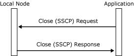

# Closing the SSCP Connection
To close the system services control point (SSCP) connection, an application sends a [Close(SSCP) Request](./close-sscp-request2.md) to the local node, which responds with a [Close(SSCP) Response](./close-sscp-response1.md). The **Close(SSCP) Request** is unconditional. The **Close(SSCP) Response** always reports that the connection was successfully closed. The **Close(SSCP) Response** is provided so that applications can determine when outstanding data and status messages on the session have been delivered.  
  
 If the logical unit (LU) is bound, the local node sends a **TERM-SELF** message to the SSCP on behalf of the application to elicit an **UNBIND**. An application that needs to be unbound can issue **Close(PLU)**. (For more information, see [Closing the PLU Connection](../core/closing-the-plu-connection1.md).) Normally, the SSCP connection can be maintained while the application task is active, even if it is idle.  
  
 Closing the connection invalidates the locality, partner, index (LPI) pair for the connection, but does not alter the state of the SSCP session. The following figure shows the message flow.  
  
   
Message flow for closing a connection  
  
## See Also  
 [Opening the SSCP Connection](../core/opening-the-sscp-connection1.md)   
 [SSCP Session](../core/sscp-session2.md)   
 [RTM Parameters\]](../core/rtm-parameters]2.md)   
 [3270 User Alerts](../core/3270-user-alerts2.md)
