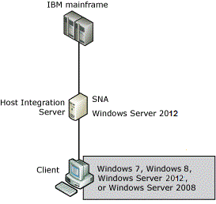

# Communication Between Host Integration Server Computers and a Host Computer
Within the context of [!INCLUDE[hisHostIntServNoVersion](../includes/hishostintservnoversion-md.md)], a connection is the data communication path between a Host Integration Server computer and an IBM host (mainframe or AS/400). A connection corresponds to a physical unit (PU) definition on a mainframe or an APPC controller definition on an AS/400. The connection is what makes it possible for a personal computer on the LAN to communicate with a host by means of a Host Integration Server computer. 
  
 The following figure shows a Host Integration Server network connected to an IBM mainframe.  
  
   
Host Integration Server network connected to IBM mainframe  
  
 For each physical adapter or connection, an appropriate link service is installed and configured within Host Integration Server. The link service is a Windows server service or device driver that is used to control server-to-host communication adapters supported by Host Integration Server. The link service provides the HPR protocol used by the Host Integration Server computer to communicate with the host.  
  
 After a link service is configured, you can create connections. A link service may support multiple links to one or more hosts.  
  
 In SNA terms, the combination of a connection and the link service it uses is equivalent to a PU. In hierarchical SNA networks, Host Integration Server provides PU 2.0 functionality. For peer-oriented SNA networks, Host Integration Server provides PU 2.1 LEN node functionality.  
  
 In this Section  
  
 [Physical Unit (PU)](../core/physical-unit-pu-1.md)  
  
 [Logical Unit (LU)](../core/logical-unit-lu-1.md)  
  
 [Choosing a Connection Type](../core/choosing-a-connection-type1.md)  
  
## See Also  
 [SNA Service](../core/sna-service2.md)