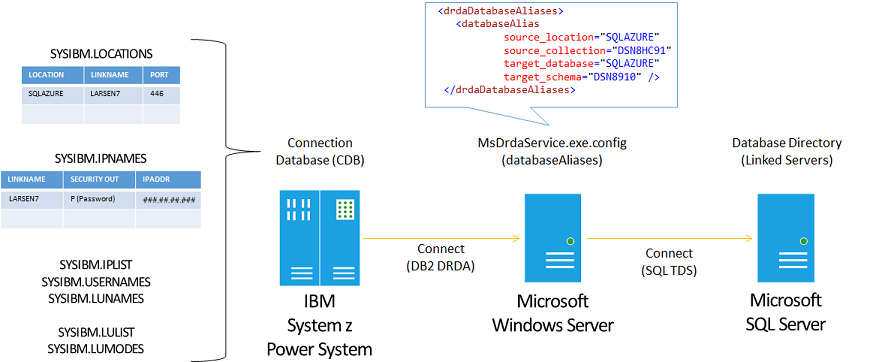

# Configuring DB2 for z-OS
IBM DB2 for z/OS supports access to remote DRDA Application Servers using information stored in the DB2 for z/OS Communications Database (CDB), which is a collection of catalog tables.  
  
|Table|Description|  
|-----------|-----------------|  
|SYSIBM.LOCATIONS|Required catalog table for defining a remote relational database, including address (TCP/IP port), security, and naming convention (alias).|  
|SYSIBM.IPNAMES|Required catalog table for defining address (TCP/IP address or alias) and security (authentication and encryption).|  
|SYSIBM.IPLIST|Optional catalog table for defining address (TCP/IP address or alias) when using failover.|  
|SYSIBM.USERNAMES|Optional catalog table for defining authentication mapping.|  
  
 *DB2 for z/OS Communications Database tables.*  
  
 You can update the CDB tables using dynamic SQL statements, either locally (e.g. DB2 Admin, QMF, SPUFI) or remotely (e.g. Microsoft Data Provider for DB2 with SQL Server Management Studio).  
  
   
  
 DB2 for z/OS Communications Database tables.  
  
### SQL Server Management Studio  
 Using the Microsoft OLE DB Provider for DB2 with SQL Server Management Studio and a Distributed Query Processor (DQP) Linked Server, you can configure the DB2 for z/OS Configuration Database (CDB) to enable DRDA connectivity over a TCP/IP network connection to the DRDA Service.  
  
1.  On the **Start** menu, point to **All Programs**, point to **Microsoft SQL Server 2008 R2** (SQL Server 2008, SQL Server 2012), click **SQL Server Management Studio**.  
  
2.  In the **Connect to Server** dialog, type a **Server name** (e.g. **LOCALHOST**), and then click **Connect**.  
  
3.  In the **Microsoft SQL Server Management Studio**, on the **File** menu, click **New**, and then click **Query with Current Connection**.  
  
4.  Copy and paste the examples below into the SQLQuery1.sql file within the Query Editor window, and then modify the bold yellow highlighted text to match values for your DB2 instance, DRDA Service, and SQL Server database.  
  
#### SQL Server Linked Server Name  
 These system stored procedures define a SQL Server Linked Server Name for connecting to DB2 for z/OS. Optionally, or if you do not have authority, you can ask your DB2 administrator to update the DB2 connection database tables.  
  
```  
-- ----------------------------------  
-- Microsoft Service for DRDA Example  
-- ----------------------------------  
-- Drop existing linked server by name  
EXEC sp_dropserver  
@server = 'DRDA_AS_Example',  
@droplogins = 'droplogins';  
-- Add linked server for use with Microsoft OLE DB Provider for DB2 (DB2OLEDB)  
EXEC sp_addlinkedserver   
@server = 'DRDA_AS_Example',   
@srvproduct = 'Microsoft OLE DB Provider for DB2',  
@provider = 'DB2OLEDB',   
@catalog = 'DSN1D037',  
@provstr ='Provider=DB2OLEDB;Initial Catalog=DSN1D037;Network Transport Library=TCPIP;Host CCSID=37;PC Code Page=1252;Network Address=SYS1;Network Port=446;Package Collection=HISDEMO;Default Schema=HISDEMO;Default Qualifier=HISDEMO;DBMS Platform=DB2/NT'  
-- Add linked server login by specifying valid DB2 user identifer and password  
EXEC sp_addlinkedsrvlogin   
@rmtsrvname = 'DRDA_AS_Example',   
@rmtuser = 'HISDEMO',   
@rmtpassword = 'HISDEMO';  
-- List linked servers  
EXEC sp_linkedservers;  
-- Specify linked server option to support Remote Procedure Call (to allow execution of DB2 stored procedures)  
EXEC sp_serveroption   
@server =  'DRDA_AS_Example',  
@optname =  'RPC OUT',  
@optvalue =  'TRUE' ;  
-- List linked servers options  
EXEC sp_helpserver;  
  
```  
  
 Defining SQL Server Linked Server using SQL Server Management Studio.  
  
#### Updating SYSIBM.LOCATIONS table  
 These system stored procedures define SQL Server Pass-Thru queries for defining a LOCATION in the DB2 for z/OS connection database.  
  
|DB2 for z/OS|Description|  
|-------------------|-----------------|  
|LOCATION|Specify a value that matches the name of the target SQL Server database name (e.g. NWIND).<br /><br /> If you cannot specify a LOCATION name value that matches the target SQL Server database (e.g. LOCATION name is in use; SQL Server database name is too long), then use the DBALIAS and the MsDrdaService.exe.config entries (drdaDatabaseAliases) to instruct the DRDA Service how to interpret and map the LOCATION and DBALIAS to a corresponding SQL Server database name.<br /><br /> LOCATION is known as the DRDA RDBNAME (Relational Database Name).<br /><br /> LOCATION is known as the SQL Server Database Name or Initial Catalog.|  
|LINKNAME|This value is used to associate the record in the SYSIBM.LOCATIONS table to the records in the SYSIBM.IPNAMES, SYSIBM.IPLIST, and SYSIBM.USERNAMES tables. This value is limited to 8 characters when running DB2 for z/OS in compatibility mode.|  
|IBMREQD|Specify “N”.|  
|PORT|Specify a value for the TCP/IP port for use by the DRDA Service running on the SQL Server computer. For example, the default DRDA port number is 446.|  
|TPN|Specify “”. The DRDA Service does not support an alternate TPN (Transaction Program Name).|  
|DBALIAS|Specify a value that matches the name of the target SQL Server database name (e.g. NWIND), if you cannot specify this value in the LOCATION field. When using the DBALIAS, you must utilize the MsDrdaService.exe.config entries (drdaDatabaseAliases) to instruct the DRDA Service how to interpret and map the LOCATION and DBALIAS to a corresponding SQL Server database name.|  
|TRUSTED|Specify “N”. The DRDA Service does not support a trusted connection.|  
|SECURE|Specify “Y” when connecting to the DRDA Service using Secure Sockets Layer 4.0 or Transport Layer Security 1.0.|  
  
 DB2 for z/OS Connection Database SYSIBM.LOCATION table.  
  
```  
-- --------------------------------------------------  
-- Distributed Relational Database Entries  
-- --------------------------------------------------  
--SYSIBM.LOCATIONS  
--LOCATION VARCHAR(128) NOT NULL  
--LINKNAME VARCHAR(24) NOT NULL  
--IBMREQD CHAR(1) NOT NULL WITH DEFAULT 'N'  
--PORT VARCHAR(96) NOT NULL WITH DEFAULT '446'  
--TPN VARCHAR(192) NOT NULL WITH DEFAULT X’07F6C4C2’  
--DBALIAS VARCHAR(128) NOT NULL   
--TRUSTED CHAR(1) NOT NULL WITH DEFAULT 'N'  
--SECURE CHAR(1) NOT NULL WITH DEFAULT 'N'  
EXECUTE ('  
DELETE FROM SYSIBM.LOCATIONS WHERE LINKNAME = ''HISDRDA1''  
') AT DRDA_AS_Example;  
GO  
EXECUTE ('  
INSERT INTO SYSIBM.LOCATIONS VALUES (''CONTOSO'', ''HISDRDA1'', ''N'', ''446'', '''', '''', ''N'', ''N'')  
') AT DRDA_AS_Example;  
GO  
```  
  
 SYSIBM.LOCATIONS entries in DB2 for one DRDA Service (“HISDRDA1”).  
  
#### Updating SYSIBM.IPNAMES table  
 These system stored procedures update the SYSIBM.IPNAMES table on DB2 for z/OS.  
  
|DB2 for z/OS|Description|  
|-------------------|-----------------|  
|LINKNAME|This value is used to associate the record in the SYSIBM.IPNAMES table to the records in the SYSIBM.LOCATIONS, SYSIBM.IPLIST, and SYSIBM.USERNAMES tables.|  
|SECURITY_OUT|Specify “A” to send an authorization identifier.<br /><br /> Optionally, specify “D” to send an encrypted authorization identifier.<br /><br /> Optionally, specify “E” to send an encrypted authorization identifier and encrypted data.<br /><br /> Optionally, specify “P” to send an encrypted authorization identifier, encrypted password, and encrypted data.<br /><br /> Do not specify “R”. The DRDA Service does not support a RACF Pass Ticket.|  
|USERNAMES|Specify “” to send the authorization identifier associated with the logged in user, running task or program.<br /><br /> Optionally, specify “O” to translate outbound authorization identifier using the SYSIBM.USERNAMES.<br /><br /> Do not specify “S”. The DRDA Service does not support a trusted connection.|  
|IBMREQD|Specify “N”.|  
|IPADDR|Specify a value for the TCP/IP address or alias for the computer on which the DRDA Service is running.<br /><br /> Optionally, leave this field blank, when configuring fault tolerant failover, which relies on IPADDR entries in the SYSIBM.IPLIST table.|  
  
 DB2 for z/OS Connection Database SYSIBM.IPNAMES table.  
  
```  
--SYSIBM.IPNAMES  
--LINKNAME VARCHAR(24) NOT NULL  
--SECURITY_OUT CHAR(1) NOT NULL WITH DEFAULT 'A'  
---A=Already Verified  
---D=Data Encrypt  
---E=Auth Encrypt  
---P=Password with Authorization ID  
---R=RACF PassTicket  
--USERNAMES CHAR(1) NOT NULL WITH DEFAULT  
--IBMREQD CHAR(1) NOT NULL WITH DEFAULT 'N'  
--IPADDR VARCHAR(254) NOT NULL WITH DEFAULT  
EXECUTE ('  
DELETE FROM SYSIBM.IPNAMES WHERE LINKNAME = ''HISDRDA1''  
') AT DRDA_AS_Example;  
GO  
EXECUTE ('  
INSERT INTO SYSIBM.IPNAMES VALUES (''HISDRDA1'', ''P'', ''O'', ''N'', ''123.34.45.56'')  
') AT DRDA_AS_Example;  
GO  
```  
  
 SYSIBM.IPNAMES entries in DB2 for one DRDA Service (“HISDRDA1”).  
  
#### Updating SYSIBM.IPLIST table  
 These system stored procedures update the SYSIBM.IPLIST table on DB2 for z/OS. The IPLIST table allows you to specify multiple IP address for a given LOCATION, when using the DRDA Service with the Server List (SRVLST) for fault tolerant failover.  
  
|DB2 for z/OS|Description|  
|-------------------|-----------------|  
|LINKNAME|This value is used to associate the record in the SYSIBM.IPNAMES table to the records in the SYSIBM.LOCATIONS, SYSIBM.IPLIST, and SYSIBM.USERNAMES tables.|  
|IPADDR|Specify a value for each TCP/IP address or alias for a group of computers on which the DRDA Services are running, providing fault tolerant failover.|  
|IBMREQD|Specify “N”.|  
  
 DB2 for z/OS Connection Database SYSIBM.IPNAMES table.  
  
```  
--SYSIBM.IPLIST  
--LINKNAME VARCHAR(24) NOT NULL  
--IPADDR VARCHAR(254) NOT NULL WITH DEFAULT  
--IBMREQD CHAR(1) NOT NULL WITH DEFAULT 'N'  
EXECUTE ('  
DELETE FROM SYSIBM.IPLIST WHERE LINKNAME = ''HISDRDA1''  
') AT DRDA_AS_Example;  
GO  
EXECUTE ('  
INSERT INTO SYSIBM.IPLIST VALUES (''HISDRDA1'', ''123.34.45.56'', ''N'')  
') AT DRDA_AS_Example;  
GO  
EXECUTE ('  
INSERT INTO SYSIBM.IPLIST VALUES (''HISDRDA1'', ''123.34.45.57'', ''N'')  
') AT DRDA_AS_Example;  
GO  
```  
  
 SYSIBM.IPLIST entries for connecting to two DRDA Services (“HISDRDA1” and “HISDRDA2”).  
  
#### Updating SYSIBM.USERNAMES table  
 These system stored procedures update the SYSIBM.USERNAMES table on DB2 for z/OS.  
  
|DB2 for z/OS|Description|  
|-------------------|-----------------|  
|TYPE|Specify “O” to translate outbound authorization identifier.<br /><br /> Do not specify “I”. The DRDA Service does not support operating as a DRDA Application Requester client.<br /><br /> Do not specify “S”. The DRDA Service does not support a trusted connection.|  
|AUTHID|Specify the authorization identifier to be translated.|  
|LINKNAME|This value is used to associate the record in the SYSIBM.IPNAMES table to the records in the SYSIBM.LOCATIONS, SYSIBM.IPLIST, and SYSIBM.USERNAMES tables.|  
|NEWAUTHID|Specify the translated value for the authorization identifier.|  
|PASSWORD|Specify the password.|  
|IBMREQD|Specify “N”.|  
  
 DB2 for z/OS Connection Database SYSIBM.USERNAMES table.  
  
```  
--SYSIBM.USERNAMES  
--TYPE CHAR(1) NOT NULL  
---I=Inbound transalation  
---O=Outbound translation  
---S=Outbound AUTHID trusted connection  
--AUTHID VARCHAR(128) NOT NULL WITH DEFAULT  
--LINKNAME VARCHAR(24) NOT NULL  
--NEWAUTHID VARCHAR(128) NOT NULL WITH DEFAULT  
--PASSWORD VARCHAR(24) NOT NULL  
--IBMREQD CHAR(1) NOT NULL WITH DEFAULT 'N'  
EXECUTE ('  
DELETE FROM SYSIBM.USERNAMES WHERE LINKNAME = ''HISDRDA1''  
') AT DRDA_AS_Example;  
GO  
EXECUTE ('  
INSERT INTO SYSIBM.USERNAMES VALUES (''O'', ''DBUSRID'', ''HISDRDA1'', '''', ''DBUSRPWD'', ''N'')  
') AT DRDA_AS_Example;  
GO  
  
EXECUTE ('  
SELECT * FROM SYSIBM.LOCATIONS  
') AT DRDA_AS_Example;  
EXECUTE ('  
SELECT * FROM SYSIBM.IPNAMES  
') AT DRDA_AS_Example;  
EXECUTE ('  
SELECT * FROM SYSIBM.USERNAMES  
') AT DRDA_AS_Example;  
GO  
```  
  
 SYSIBM.USERNAMES entries in DB2 for one DRDA Service (“HISDRDA1”).  
  
### DRDA Connections  
 DRDA ARs, including IBM DB2 for z/OS, offer various methods of defining the remote DRDA connection—network address, port, and authentication. For example, IBM DB2 for z/OS relies on a CDB (Connection Database) comprised of a set of SYSIBM.* tables (LOCATIONS, IPNAMES, USERNAMES).  
  
 Also, IBM DB2 for z/OS supports multiple methods of initiating a DRDA connection to a remote system. A COBOL for TSO program locally-attached to DB2 for z/OS can connect to SQL Server via the DRDA Service using either (a) an explicit connection based on a SQL CONNECT statement or (b) an implicit connection based on a SQL 3-part object identifier (CATALOG.SCHEMA.TABLE).  
  
   
  
 Figure 1. DRDA directed data access supports both implicit and explicit connections.  
  
#### Connect statement  
 A common technique is to use a SQL CONNECT statement to create an explicit connection from a local DRDA AR to a remote DRDA AS, using pre-configured authentication, in-line authentication credentials, or mapped credentials.  
  
```  
CONNECT TO CONTOSO; SELECT * FROM DSN8910.DEPT  
```  
  
 or  
  
```  
CONNECT TO :LOC USER :USERID USING :PASSWORD; SELECT * FROM DSN8910.DEPT  
```  
  
 SQL CONNECT statements.  
  
#### Three-part object identifier  
 Another common technique is to use a 3-part object identifier within a SQL statement to create an implicit connection from a local DRDA AR to a remote DRDA AS.  
  
```  
CONNECT TO :LOC USER :USERID USING :PASSWORD; SELECT * FROM DSN8910.DEPT  
```  
  
 Using a 3-part object identifier in a SQL statement.  
  
#### Alias for three-part object identifier  
 Optionally, one can encapsulate the 3-part name within a 2-part local table alias. To define an alias for use with DB2 for z/OS and a remote DRDA server, one must follow these steps.  
  
- Define an alias in the local DB2 for z/OS database.  
  
  ```  
  CREATE ALIAS DSN8910. FOR RDB1.COL1.TABLE1  
  ```  
  
- Define a corresponding synonym or view in the remote SQL Server database.  
  
  ```  
  CREATE SYNONYM [DSN8910].[ADEPT] FOR [DSN8910].[DEPT]  
  CREATE VIEW [DSN8910].[VDEPT] ("DEPTNO", "DEPTNAME", "MGRNO", "ADMRDEPT") AS SELECT ALL DEPTNO , DEPTNAME, MGRNO , ADMRDEPT FROM DSN8910.DEPT  
  ```  
  
- Reference the local DB2 for z/OS alias in a SQL statement.  
  
  ```  
  SELECT * FROM CONTOSO.DSN8910.ADEPT  
  SELECT * FROM CONTOSO.DSN8910.VDEPT  
  ```  
  
  Defining and using a DB2 for z/OS alias over a 3-part object identifier in a SQL statement.  
  
### Verify DB2 for z/OS to DRDA Service connection using QMF  
 You can verify the DB2 for z/OS to DRDA Service connection by using QMF and a number of other host-resident DB2 client programs.  
  
1.  On the **Start** menu, point to **All Programs**, point to **Microsoft Host Integration Server 2010**, click **Tools**, and then click **3270 Client**.  
  
2.  In the **Host Integration Server 3270 Client** (3270 Client) window, click **Session** menu, and then **Session Configuration**.  
  
3.  In the **3270 Settings** dialog, select **TN3270E Server Connection**, type “**SYS1**” in the **Server Name** edit box, and then click **OK**.  
  
4.  On the **Session** menu, click **Connect**. The **3270 Client** will display the SSCP screen. At the cursor (lower left corner), type **TSO HISDEMO**, and then press **Enter**.  
  
5.  On the **TSO/E LOGON** screen, at the cursor (**Password** field), enter **HISDEMO**, and then press **Enter**.  
  
6.  On the **Welcome** screen, press **Enter**, to retrieve the rest of the screen data. Below the **READY** prompt, type **ISPF**, and then press **Enter**.  
  
7.  On the **ISPF Primary Option Menu** screen, press **Enter**, to clear the **IBM license text**. At the cursor (**Option**), type **U**, and then press **Enter**.  
  
8.  At the **USER OPTIONS SELECTION MENU** screen, at the cursor (**SELECT OPTION**), type **B**, and then press **Enter**.  
  
9. At the **DB2I PRIMARY OPTION MENU** screen, at the cursor (**COMMAND**), type **Q**, and then press **Enter**.  
  
10. At the **QMF HOME PANEL** screen, at the cursor (**COMMAND**), press **F6**.  
  
11. At the **SQL QUERY** screen, at the cursor (**COMMAND**), press **Tab**, and then press **Tab** again. At the **cursor** (two lines below the SQL QUERY screen label), type **SELECT \* FROM NWIND.DBO.CUSTOMERS**, and then press **F2**.  
  
12. On the **REPORT** screen, view the results from the query. Optionally, press **F8** to scroll forward, and then press **F11** to scroll right. Press **F6** to return to the **SQL QUERY** screen. Press **F3** to return to the **QMF HOME PANEL** screen.  
  
### DB2 for z/OS Bind Copy Static SQL Packages  
 You can bind copy static SQL packages from DB2 for z/OS to the DRDA AS, with which to define Static SQL Package XML files for later creation of corresponding SQL Server stored procedures. You can run the DB2 for z/OS Bind Copy command from the DB2 Bind Package Utility or DB2 Administration utility using a 3270 terminal emulation program.  
  
#### DB2 Bind Package Utility  
  
1.  On the **Start** menu, point to **All Programs**, point to **Microsoft Host Integration Server 2010**, click **Tools**, and then click **3270 Client**.  
  
2.  In the **Host Integration Server 3270 Client** (3270 Client) window, click **Session** menu, and then **Session Configuration**.  
  
3.  In the **3270 Settings** dialog, select **TN3270E Server Connection**, type “**SYS1**” in the **Server Name** edit box, and then click **OK**.  
  
4.  On the **Session** menu, click **Connect**. The **3270 Client** will display the SSCP screen. At the cursor (lower left corner), type **TSO HISDEMO**, and then press **Enter**.  
  
5.  On the **TSO/E LOGON** screen, at the cursor (**Password** field), enter **HISDEMO**, and then press **Enter**.  
  
6.  On the **Welcome** screen, press **Enter**, to retrieve the rest of the screen data. Below the **READY** prompt, type **ISPF**, and then press **Enter**.  
  
7.  On the **ISPF Primary Option Menu** screen, press **Enter**, to clear the **IBM license text**. At the cursor (**Option**), type **U**, and then press **Enter**.  
  
8.  On the **USER OPTIONS SELECTION MENU** screen, at the cursor (**SELECT OPTION**), type **B**, and then press **Enter**.  
  
9. On the **DB2I PRIMARY OPTION MENU** screen, at the cursor (**COMMAND**), type **D**, and then press **Enter**.  
  
10. On the **DB2I DEFAULTS PANEL 1** screen, at the cursor (**COMMAND**), press **Tab** twice to place cursor on the **DB2 NAME** field, type **DSN1**, and then press **Enter**.  
  
11. On the **DB2I DEFAULTS PANEL 2** screen, at the cursor (**COMMAND**), press **Enter**.  
  
12. On the **DB2I PRIMARY OPTION MENU** screen, at the cursor (**COMMAND**), type **5**, and then press **Enter**.  
  
13. On the **BIND/REBIND/FREE** screen, at the cursor (**COMMAND**), type **4**, and then press **Enter**.  
  
14. On the **BIND PACKAGE** screen, in the **LOCATION NAME** field type “**HISDRDA1**”, and then press **Tab**. In the **COLLECTION-ID** field, type “**DBO**”, and then press **Tab**. In the **DBRD** or “**COPY**” option field, type **COPY**, and then press **Tab**. In the **COLLECTION-ID** field, type “**DBO**”, and then press **Tab**. In the **PACKAGE-ID** field, type “**PKGAREAS**”, and then press **Tab** to locate the cursor on the **ACTION ON PACKAGE** field. In the **ACTION ON PACKAGE** field, type “**ADD**”, and then press **Enter**.  
  
#### DB2 Admin Bind Copy Package  
  
1.  On the **Start** menu, point to **All Programs**, point to **Microsoft Host Integration Server 2010**, click **Tools**, and then click **3270 Client**.  
  
2.  In the **Host Integration Server 3270 Client** (3270 Client) window, click **Session** menu, and then **Session Configuration**.  
  
3.  In the **3270 Settings** dialog, select **TN3270E Server Connection**, type “**SYS1**” in the **Server Name** edit box, and then click **OK**.  
  
4.  On the **Session** menu, click **Connect**. The **3270 Client** will display the SSCP screen. At the cursor (lower left corner), type **TSO HISDEMO**, and then press **Enter**.  
  
5.  On the **TSO/E LOGON** screen, at the cursor (**Password** field), enter **HISDEMO**, and then press **Enter**.  
  
6.  On the **Welcome** screen, press **Enter**, to retrieve the rest of the screen data. Below the **READY** prompt, type **ISPF**, and then press **Enter**.  
  
7.  On the **ISPF Primary Option Menu** screen, press **Enter**, to clear the **IBM license text**. At the cursor (**Option**), type **M**, and then press **Enter**.  
  
8.  On the **USER OPTIONS SELECTION MENU** screen, at the cursor (**SELECT OPTION**), type **B**, and then press **Enter**.  
  
9. On the **IBM Products Panel** screen, at the cursor (**Option**), type **3**, and then press **Enter**.  
  
10. On the **DB2 Admin – Active DB2 Systems** screen, at the cursor (**DB2 system name**), type DSN1, and then press **ENTER**.  
  
11. On the **DB2 Admin – DB2 Administration Menu** screen, press **Enter**, to clear the **IBM license text**. At the cursor (**Option**), type **1**, and then press **Enter**.  
  
12. On the **DB2 Admin – DSN1 System Catalog** screen, at the cursor (**Option**), type **K**, and then press **Enter**.  
  
13. On the **DB2 Admin – DSN1 Packages** screen, at the cursor (**Option**), press F8 repeatedly to scroll forward through the list, until you see the source **Collection** and package **Name**. Optionally, press **F7** to scroll to the previous items in the list. On the line corresponding with the source Collection and package Name, under column **S**, type **BC**, and then press **Enter**.  
  
14. On the **DB2 Admin – DSN1 Bind Copy Package** screen, at the cursor (**Command**), press **Tab** to position the cursor in the **Location** field, type the target Location name (e.g. “**HISDRDA1**”). Press **Tab** to position the cursor in the **Collection** field, type the target schema name (e.g. “**DBO**”), and then press **ENTER**.