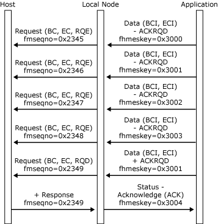
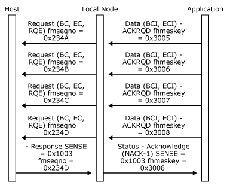
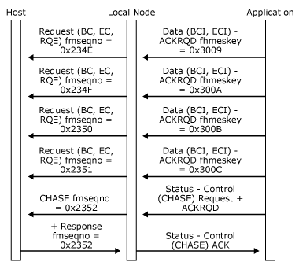

# Confirmation and Rejection of Inbound Data
For every SNA chain of data sent or received for which responses are outstanding, such as Request Exception (RQE) or Definite Response Required (RQD), the local node maintains a correlation table entry. If the table entries become depleted, the local node will terminate the session using the most table entries. A [Status-Error](./status-error1.md) message (code 0x46) and a [Close(PLU) Request](./close-plu-request2.md) are sent to the application, and a **TERM-SELF** message is sent to the host. Table entry shortages (inbound) can be avoided by sending change direction (CD) (for half-duplex) data, or data **ACKRQD,** or any **Status-Control(CHASE)**, or **Status-Control(LUSTAT)** with **ACKRQD**. Outbound shortages can be avoided by sending courtesy acknowledge messages as described in [Opening the PLU Connection](../core/opening-the-plu-connection1.md).  
  
 The local node sends chains of data to the host with their chain response mode specified as follows:  
  
1. Definite  
  
    If the application sends a **Data** message to the local node with the **ACKRQD** field set, and the **BIND** parameters specified that the secondary uses definite or definite/exception response mode.  
  
2. Exception  
  
    If the application sends a **Data** message to the local node without the **ACKRQD** field set, and the **BIND** parameters specified that the secondary uses exception or definite/exception response mode.  
  
3. No-Response  
  
    If the application sends a **Data** message to the local node without the **ACKRQD** field set, and the **BIND** parameters specified that the secondary uses no-response mode.  
  
   If the setting of **ACKRQD** on a [Data](./data1.md) message from the application does not reflect the chain response mode specified in the **BIND** parameters, the local node returns a [Status-Acknowledge(Nack-2)](./status-acknowledge-nack-2-2.md) indicating a noncritical error code. For example, if the application specifies **ACKRQD** but the **BIND** parameters do not permit the local node to send definite response chains.  
  
   In case 1, the application receives an acknowledgment to all function management data (FMD) chains it sends to the local node:  
  
- Positive responses from the host are returned to the application as [Status-Acknowledge(Ack)](./status-acknowledge-ack-2.md) messages.  
  
- Negative responses from the host are returned as [Status-Acknowledge(Nack-1)](./status-acknowledge-nack-1-1.md) messages carrying the SNA sense codes.  
  
- Errors detected by the local node when attempting to send the message are returned as [Status-Acknowledge(Nack-2)](./status-acknowledge-nack-2-2.md) messages carrying the equivalent error code.  
  
  In case 2, the application only receives an acknowledgment of an FMD chain it sends to the local node for:  
  
- Negative responses from the host, which are returned as **Status-Acknowledge(Nack-1)** messages carrying the SNA sense codes.  
  
- Errors detected by the local node when attempting to send the message, which are returned as **Status-Acknowledge(Nack-2)** messages carrying the equivalent error code.  
  
  In case 3, the application only receives an acknowledgment of an FMD chain it sends to the local node when the node detects an error in the message and sends the application a **Status-Acknowledge(Nack-2)**. The only dissent that the host can make is to send a subsequent LUSTAT 0x400A (no response not supported) with the sequence number of the request in the sense qualifier field. This is presented to the application as a **Status-Control(LUSTAT)** as usual.  
  
  Whenever an application receives a **Status-Acknowledge(Ack)** or **Status-Acknowledge(Nack-1)**, it implicitly confirms receipt by the partner half-session in the host of all previously sent chains.  
  
  In case 2, the application does not usually receive such responses from the host to chains it has sent, and in case 3, the application never receives such responses. Therefore, to get the host to confirm receipt of all previously sent chains, the application should issue a **Status-Control(CHASE) Request** with ACKRQD set. This causes the local node to generate an SNA **CHASE** request to the host. The receipt of the response to this CHASE confirms that the host has received this **CHASE** request and all previous chains sent by the application. The local node issues a **Status-Control(CHASE) Acknowledge** to notify the application that this is so.  
  
  The following three figures illustrate the inbound data confirmation and rejection protocols between the local node and the application, and how those protocols relate to the underlying SNA protocols.  
  
  In the first figure, an application sets the **ACKRQD** field in an inbound data chain to get the host to confirm receipt of the chain and all previously sent chains.  
  
    
  Application sets ACKRQD field  
  
  In the following figure, the **Status-Acknowledge(Nack-1)** rejects the last chain, but confirms receipt by the host of all previously sent data chains.  
  
    
  Status-Acknowledge(Nack-1) rejects the last chain, but confirms receipt  
  
  In the following figure, the application uses a **Status-Control(CHASE)** to get the host to confirm receipt of the corresponding **CHASE** request and all previously sent chains.  
  
    
  Using a Status-Control(CHASE) to get the host to confirm receipt of the corresponding CHASE request  
  
## See Also  
 [Opening the PLU Connection](../core/opening-the-plu-connection1.md)   
 [PLU Session](../core/plu-session2.md)   
 [Outbound Chaining](../core/outbound-chaining2.md)   
 [Inbound Chaining](../core/inbound-chaining1.md)   
 [Segment Delivery](../core/segment-delivery1.md)   
 [Brackets](../core/brackets1.md)   
 [Direction](../core/direction1.md)   
 [Pacing and Chunking](../core/pacing-and-chunking1.md)   
 [Confirmation and Rejection of Data\]](../core/confirmation-and-rejection-of-data]1.md)   
 [Shutdown and Quiesce](../core/shutdown-and-quiesce1.md)   
 [Recovery](../core/recovery1.md)   
 [Application-Initiated Termination](../core/application-initiated-termination1.md)   
 [LUSTATs\]](../core/lustats]1.md)   
 [Response Time Monitor Data](../core/response-time-monitor-data1.md)