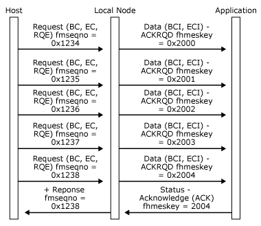
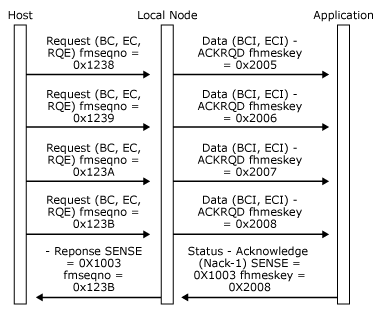
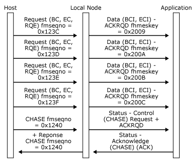

# Confirmation and Rejection of Outbound Data
The local node sends chains of data from the host to the application with their **ACKRQD** field set as follows:  
  
-   **ACKRQD** set  
  
     If the corresponding SNA request was received specifying definite response, and the **BIND** parameters specify that the primary uses definite or definite/exception chain response mode.  
  
1. **ACKRQD** not set, response mode  
  
    If the corresponding SNA request was received specifying exception response, and the **BIND** parameters specify that the primary uses exception or definite/exception chain response mode.  
  
2. **ACKRQD** not set, no-response mode  
  
    If the corresponding SNA request was received specifying no response, and the **BIND** parameters specify that the primary uses no-response chain response mode.  
  
   In case 1, the application should always send an acknowledgment as follows:  
  
- If the application accepts the data, it should return a [Status-Acknowledge(Ack)](./status-acknowledge-ack-2.md) message.  
  
- If the application wants to reject the data, it should return a **Status-Acknowledge(Nack-1)** message carrying the appropriate SNA sense codes.  
  
  In case 2, the application should only send an acknowledgment in the following cases:  
  
- If the application wants to reject the data, it should return a **Status-Acknowledge(Nack-1)** message carrying the appropriate SNA sense codes.  
  
- The application can send a courtesy acknowledgement to a Request Exception (RQE) message to clear up correlation data within the local node. (For more information, see [Outbound Data](../core/outbound-data1.md).)  
  
  In case 3, the application should not send acknowledgments. However, the sending of a **Status-Acknowledge(Ack)** or **Status-Acknowledge(Nack-1)** by the application has no effect. It is discarded.  
  
  Whenever an application sends a **Status-Acknowledge(Ack)** or **Status-Acknowledge(Nack-1)** to a received [Data](./data1.md) message, it implicitly confirms receipt of this and all previously received Data messages.  
  
  In case 2, the host can issue a **CHASE** request. The local node sends a **Status-Control(CHASE) Request** with **ACKRQD** set to the application. When the application is in a position to confirm receipt of all outstanding data, it should issue a **Status-Control(CHASE) Acknowledge** message, which the local node converts into a positive response to **CHASE** for the host.  
  
  In cases 1 and 2, if the local node detects an error in a received request, it converts the request into a special [Data](./data1.md) message, which it passes to the application. Regardless of the chain response mode specified for the secondary in the **BIND** parameters, this **Data** message has the following characteristics:  
  
- **ACKRQD** is set. The application must confirm receipt using a [Status-Acknowledge(Ack)](./status-acknowledge-ack-2.md) message.  
  
- The Sense Data Indicator (SDI) application flag is set to indicate that this is a special Data message used to inform the application of an error detected by the local node.  
  
- The End Chain Indicator (ECI) application flag is set to indicate that the received chain has now terminated.  
  
- The first four bytes of the buffer element hold the SNA sense codes detected by the local node that caused the termination.  
  
  This mechanism enables:  
  
- The application to reject any previously received **Data** messages.  
  
- The local node to inform the application of any errors it detects in received requests.  
  
- The local node to send negative responses in the correct order.  
  
  The following three figures illustrate the outbound data confirmation and rejection protocols between the local node and the application and how those protocols relate to the underlying SNA protocols.  
  
  In the first figure, the host sends a definite response chain to get the application to confirm receipt of the RQD request and all previously sent RQE chains.  
  
    
  Host sends a definite response chain  
  
  In the following figure, a **Status-Acknowledge(Nack-1)** from the application rejects the last chain and confirms receipt of all previously sent data chains.  
  
    
  Status-Acknowledge(Nack-1) rejects the last chain and confirms receipt  
  
  In the following figure, the host sends a **CHASE** request to get the application to confirm receipt of the **CHASE** and all previously sent chains.  
  
    
  Host sends a CHASE request  
  
## See Also  
 [Opening the PLU Connection](../core/opening-the-plu-connection1.md)   
 [PLU Session](../core/plu-session2.md)   
 [Outbound Chaining](../core/outbound-chaining2.md)   
 [Inbound Chaining](../core/inbound-chaining1.md)   
 [Segment Delivery](../core/segment-delivery1.md)   
 [Brackets](../core/brackets1.md)   
 [Direction](../core/direction1.md)   
 [Pacing and Chunking](../core/pacing-and-chunking1.md)   
 [Confirmation and Rejection of Data\]](../core/confirmation-and-rejection-of-data]1.md)   
 [Shutdown and Quiesce](../core/shutdown-and-quiesce1.md)   
 [Recovery](../core/recovery1.md)   
 [Application-Initiated Termination](../core/application-initiated-termination1.md)   
 [LUSTATs\]](../core/lustats]1.md)   
 [Response Time Monitor Data](../core/response-time-monitor-data1.md)