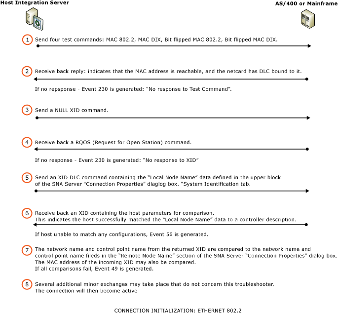

# Connection Initialization Sequence
When troubleshooting pending DLC Connections, it is helpful to review the connection initialization sequence that occurs between the [!INCLUDE[hisHostIntServNoVersion](../includes/hishostintservnoversion-md.md)] computer and the host platform.  
  
 The following diagram applies to both AS/400 and mainframe connections:  
  
   
Connection initialization sequence  
  
 In this section are the following topics:  
  
 [Connection Initialization Overview](../core/connection-initialization-overview1.md)  
  
 [Connection Initialization Details](../core/connection-initialization-details2.md)