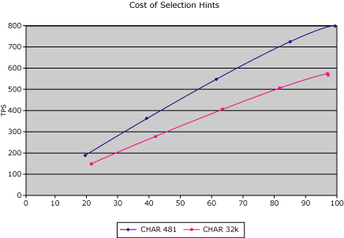

# Cost of Remote Environment Selection
The following figure shows the transaction throughput against the CPU load on the middle tier (the business-logic tier). Each data point represents the number of stress clients, and the total amount of time that it takes for the clients to finish their transactions. (For example, eight clients simultaneously perform transactions at a collective rate of approximately 200 TPS.) Both requests and responses consist of 481 bytes of mixed data (text and numeric).  
  
   
Chart displaying transactions per second on the vertical axis and percent CPU on the horizontal axis  
  
 The arrow in the graph shows the last level of CPU use at which transactions using `SelectionHint` and transactions not using `SelectionHint` ran at a similar number of TPS. Pushing the load beyond this level causes a drop in throughput. Up to the 85% CPU load level, you will see the same response time for both types of transactions. Using the `SelectionHint` property provides additional flexibility with only a very small cost in maximum throughput level (15%). On the other hand, when pushing 680 TPS through the server, not using `SelectionHint` drops the CPU from above 80% to a comfortable 60% level. These CPU cycles can be used to process the business logic on the middle tier.  
  
## See Also  
 [Remote Environment Selection with the SelectionHint Property](../core/remote-environment-selection-with-the-selectionhint-property2.md)
