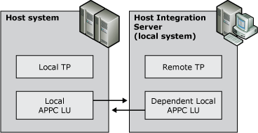

# Dependent APPC LUs
A dependent local APPC LU requires the support of a mainframe to communicate with a remote TP. Dependent APPC LUs cannot be used to communicate with an AS/400 computer.  
  
 The next figure illustrates how a dependent APPC LU can communicate with the host.  
  
   
Dependent APPC LU communications with the host  
  
 Dependent local LUs have the following characteristics:  
  
-   Allow only a single session per LU.  
  
-   Use a connection configured with a Remote End of Host, not Peer.  
  
-   Only type of APPC LUs that Host Integration Server supports when communicating with a mainframe using a version of VTAM earlier than version 3, release 2.  
  
-   Require the mainframe VTAM to use a value of 1 or greater in the LOCADDR parameter in the NCP Gen.  
  
 The Network Name and LU Name are recommended but not required, because they are used only by local software such as the Microsoft® Windows® event log software. The default is the network name specified for the Host Integration Server computer. If a network name is not specified for the server, the default is APPN.  
  
 For a remote APPC LU that will be partnered with a dependent local APPC LU, the LU Name is recommended but not required. It identifies the LU to local software, such as the Windows event log software.  
  
 A number identifying the LU on its connection is required and should match the LOCADDR=parameter for the LU definition in VTAM or in the NCP Gen. Check the numbering for any non-APPC LUs on the connection that the remote APPC LU will use because this number must be unique.  
  
 The usual range for LU numbers is from 2 through 254.  
  
 A dependent APPC LU requires the support of a mainframe. During LU configuration, you need to select a host type of the connection to which the LU will be assigned. Also, the remote LU needs the same name as defined on the remote system services control point (SSCP). This name is required when using dependent APPC.  
  
## See Also  
 [Configuring Dependent LUs](../core/configuring-dependent-lus1.md)   
 [Understanding Connectivity](../core/understanding-connectivity2.md)