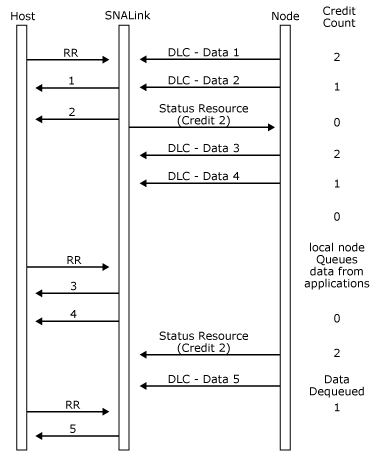

# DLC Flow Control
The flow of data messages at the data link control (DLC) interface for each link station is flow controlled. For each direction of flow, there is an initial credit of messages that can be transmitted.  
  
 Flow control is maintained by initial specification on the [Open(STATION) Request](../Topic/Open\(STATION\)%20Request1.md) and [Open(STATION) OK Response](../Topic/Open\(STATION\)%20OResponse2.md) messages, and by the sending of DLC [Status-Resource](../Topic/Status-Resource%20\(SNADIS\)2.md) messages to give more credit periodically.  
  
 The sender maintains a count of credit, starting at the initial value set on the **Open(STATION)**, which is decremented for each [DLC-Data](../Topic/DLC-Data2.md) message sent. When the credit count reaches zero, no more DLC-Data messages can be sent until more credit is received.  
  
 For flow in a given direction, the amount of credit is specified by the recipient of the data, because the recipient has to do any queuing. The initial credit values are passed on the [Open(STATION)](../Topic/Open\(STATION\)2.md) message (on the request for flow from the SNALink to the local node and on the response for flow from the local node to the SNALink).  
  
 The initial credit for the flow from the SNALink to the local node is determined by the node. The initial credit for the flow from the local node to the SNALink is set by the SNALink software—a suggested value is 16.  
  
 If the SNALink runs out of credit to send to the local node, it should either queue the data or discard it and send no acknowledgment. It should also start sending receive not ready (RNR), for example, when polled by a primary station. An example message flow with an Synchronous Data Link Control (SDLC) SNALink is shown in the following figure with an initial credit of 3. When the SNALink runs out of credit, it does not acknowledge any further frames and starts sending RNR.  
  
   
Message flow with an SDLC SNALink with an initial credit of 3  
  
 For flow control from the local node to the SNALink, when the node runs out of credit, it queues the data and applies back pressure on sessions using that station. There is thus end-to-end flow control in this direction, independent of any SNA pacing that may be in force.  
  
 The SNALink gives credit to the local node for the messages that have been transmitted, not for the messages for which acknowledgments have been sent. The amount of data queuing in the SNALink is kept down most of the time because frames will usually be acknowledged.  
  
 Flow control for the flow of data from the local node to the SNALink is shown in the following figure, where the initial credit is assumed to be 2.  
  
   
Flow control for the flow of data from the local node to the SNALink