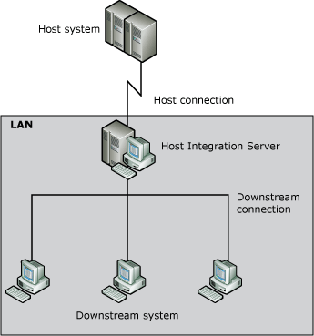

# Downstream Connections (3270)
A downstream connection enables a remote computer without a direct connection to the host computer to pass information back and forth using Host Integration Server as the gateway. To the downstream system, there appears to be a direct connection to the host. Host Integration Server accomplishes this by passing information back and forth between the downstream system and the host.  
  
 Downstream connections and LUs enable Host Integration Server to support communication between 3270 nodes using SNA protocols. A downstream system is an SNA node (a Host Integration Server computer or mainframe) that uses Host Integration Server as a physical unit (PU) gateway. To the downstream system, the Host Integration Server computer appears to be the 3270 host providing the PUs and LUs. The downstream system may be unable to communicate directly with the 3270 host because of hardware or network incompatibilities that are supported by the intermediate Host Integration Server computer.  
  
 One method of reducing host configuration requirements is to concentrate PUs on the SNA gateway computer and pass the LUs to attached downstream physical units (DSPUs). LUs from one or more PUs can be shared with one or more downstream devices. This allows for more economical use of configured resources and alleviates the need to configure each downstream device in host Virtual Storage Access Method (VSAM).  
  
 Communication by means of a downstream connection and downstream LU in Host Integration Server is always dependent (controlled by a host). Independent communication, including APPC, is not available by means of downstream LUs on Host Integration Server.  
  
 The following figure illustrates downstream connections.  
  
   
Communication with a downstream system  
  
 The information that Host Integration Server passes from the downstream system to the host includes LU information. Therefore, Host Integration Server does not store detailed LU configuration information for downstream LUs. However, Host Integration Server does require all the usual connection information for the host and downstream connections.  
  
 Two connections are needed for a downstream system: a downstream connection (from the downstream system to Host Integration Server) and an upstream connection, which is an ordinary host connection from Host Integration Server to the host.  
  
 You can configure the upstream connection as you would any other connection to the host. After that, you can configure the downstream connections. These must be 802.2 or SDLC.  
  
## See Also  
 [LUA Access](../core/lua-access2.md)   
 [Precedence of Accounts in Determining LU Access](../core/precedence-of-accounts-in-determining-lu-access1.md)   
 [Host Integration Server 3270 Connectivity](../core/host-integration-server-3270-connectivity2.md)