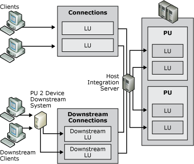

# Downstream Connections
In a hierarchical SNA environment, you configure 3270 communications between SNA nodes using SNA protocols. Usually those nodes are Host Integration Server computers and mainframes. A downstream system, however, is an SNA node that uses Host Integration Server as a physical unit (PU) gateway. To the downstream system, the Host Integration Server computer appears to be the actual mainframe providing the PUs and 3270 LUs. The following figure illustrates a downstream system.  
  
   
Diagram of a downstream system  
  
 A downstream system in this type of environment must be a PU 2 device, for instance, a cluster controller like an IBM 3745, or a client personal computer running a terminal emulator that emulates a PU 2 and acquires LU sessions from the Host Integration Server computer.  
  
 On the Host Integration Server computer, two connections are required to support downstream systems:  
  
- A host connection between the server and the mainframe. This can be any standard physical connection method supported by the mainframe.  
  
- A downstream connection between the server and the downstream system. This physical connection can be a DLC 802.2, SDLC, or X.25 connection.  
  
  Once configured, Host Integration Server can manage the downstream LUs in a manner similar to other LUs, including assigning them to LU pools.  
  
## See Also  
 [Deployment Strategies (Downstream Connections)](../core/deployment-strategies-downstream-connections-2.md)   
 [Planning 3270 Connectivity](../core/planning-3270-connectivity2.md)