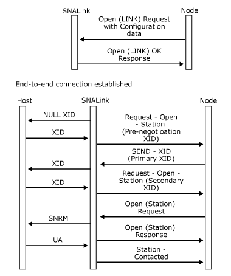

# Fixed Link Roles
The following figure shows the sequence of messages for a peer connection where the local end is configured as the primary station and the remote end is configured as the secondary.  
  
   
Sequence of messages from a peer connection where the local end is configured as the primary station
