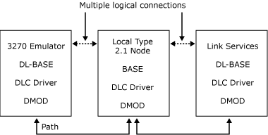

# FMI Concepts
The local node provides the SNA layers of path control, transmission control, and data flow control (DFC), as well as logical unit (LU) services as shown in the following figure. In terms of the SNA layers, the function management interface (FMI) is between presentation services and DFC. This means that most of the SNA protocol handling is performed by the local node. In particular, the DFC layer of the local node is responsible for the state changes associated with chaining, bracket, and quiesce protocols.  
  
 The FMI is defined in terms of the messages that are sent across the interface. Note that this is logically distinct from the definition of the DL-BASE/Dynamic Access Module (DMOD) interface, which defines the mechanism for sending messages between two components in Microsoft® Host Integration Server (for example, between the local node and the 3270 emulator).  
  
 The FMI is used by LU types 0, 1, 2, and 3, but not by LU type 6.2. It provides access to the system services control point (SSCP)-LU session as well as the main primary logical unit (PLU)-SLU session. (For more information about these sessions, see [Sessions and Connections](../core/sessions-and-connections2.md).) An application can use the FMI to access multiple sessions and hence multiple LUs, simultaneously.  
  
   
Emulator communicating with the local node, which communicates with the link service  
  
 In this example, the 3270 emulator on the client communicates over the local area network (LAN) with the local node on the server by exchanging messages. The content and format of the messages are defined by the FMI. The DMOD is used to transport the messages, but does not interpret them. The local node provides the SNA service for formatting the message. The link service and the data link control (DLC) driver are responsible for transferring data between the local node and the DLC adapter.  
  
## In This Section  
  
-   [Sessions and Connections](../core/sessions-and-connections2.md)  
  
-   [Application Flags](../core/application-flags1.md)
