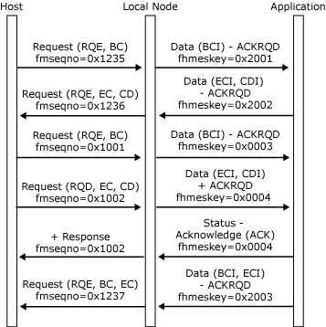
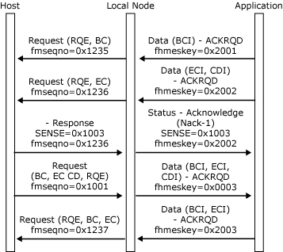
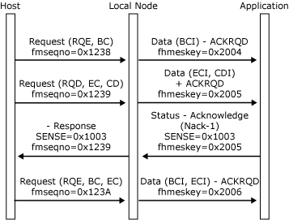

# Half-Duplex Flip-Flop Direction
The **BIND** used to establish the session carries information about the initial state of the bracket and direction machines. This can be specified in the **BIND** if either of the following conditions are satisfied:  
  
-   Brackets are not used.  
  
-   Brackets reset state is in-bracket.  
  
 If neither of the conditions hold, the initial direction state is contention.  
  
 When the direction is specified in the **BIND**, the application should assume the direction state specified in the half-duplex reset state as soon as data can flow. This field can be obtained indirectly by using a **BIND** check index that only accepts a particular direction, or directly by reading the **HDXRSET** field in the bind information control block (BICB) on the [Open(PLU) OK Confirm](../core/open-plu-oconfirm2.md) message or by reading the **BIND** on the [Open(PLU) Request](../core/open-plu-request1.md). For more information about opening the PLU connection, see [Opening the PLU Connection](../core/opening-the-plu-connection2.md).  
  
 When in contention state, either the PLU or the application can initiate a bracket. (For more information, see [Brackets](../core/brackets2.md).) The successful initiator of the bracket obtains direction unless direction is relinquished when opening the bracket by sending Begin Bracket (BB), Begin Chain (BC), End Chain (EC), or Change Direction (CD). Because the secondary is assumed to be the contention winner, the application can assume send state from contention sending BB and rejecting any subsequent **Status-Control(BID) Request** from the local node before receiving **Status-Session(BETB)**. When the application accepts a S**tatus-Control(BID) Request** in contention state, it must assume receive state.  
  
 Half-duplex flip-flop direction can change through the following actions:  
  
-   Sending or receiving data with the change direction (CD) indicator in the RH, and the corresponding change direction indicator (CDI) flag on the **DATAFMI** and [Status-Control](../core/status-control2.md) messages. Note that CD is only used at the end of a chain (and for applications receiving segments that will be delivered with ECI, EBIUI). Also note that CD is valid on the following normal flow **Status-Control** requests: **LUSTAT**, **CANCEL**, **CHASE** and **QC**.  
  
-   Receiving a negative response when the application should assume receive state (error recovery pending state). For more information, see [Recovery](../core/recovery2.md).  
  
-   If the application rejects data from the host carrying CDI, it must remain in receive state.  
  
 Providing the FM profile is correct (3, 4, or 7), the application can request direction from the host using a **Status Control(SIGNAL) Request** with CODE1 set to 0x0001. CODE2 is set to a user-defined value.  
  
 The following three figures illustrate the direction protocol for applications using the half-duplex flip-flop mode.  
  
 In the first figure, the application issues and receives the CD without error.  
  
   
Application issues and receives the CD without error  
  
 In the following figure, the host sends a negative response to inbound data. The application assumes receive state, and then the host sends CD to give the application direction.  
  
   
Host sends negative response to inbound data  
  
 In the following figure, a complete outbound chain is received without error, but is rejected by the application. Note that even though the chain carried CD, the application does not have direction.  
  
   
Complete outbound chain received without error, but is rejected by application  
  
## See Also  
 [Opening the PLU Connection](../core/opening-the-plu-connection2.md)   
 [PLU Session](../core/plu-session1.md)   
 [Outbound Chaining](../core/outbound-chaining1.md)   
 [Inbound Chaining](../core/inbound-chaining2.md)   
 [Segment Delivery](../core/segment-delivery2.md)   
 [Brackets](../core/brackets2.md)   
 [Direction](../core/direction2.md)   
 [Pacing and Chunking](../core/pacing-and-chunking2.md)   
 [Confirmation and Rejection of Data\]](../core/confirmation-and-rejection-of-data]2.md)   
 [Shutdown and Quiesce](../core/shutdown-and-quiesce2.md)   
 [Recovery](../core/recovery2.md)   
 [Application-Initiated Termination](../core/application-initiated-termination2.md)   
 [LUSTATs\]](../core/lustats]2.md)   
 [Response Time Monitor Data](../core/response-time-monitor-data2.md)