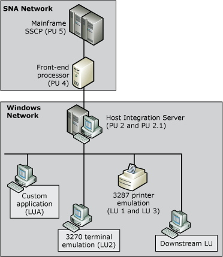

# Host Integration Server 3270 Connectivity
In the hierarchical SNA network model most frequently associated with a mainframe computer, you access centralized applications from remote terminals across a network. This network model uses the information display protocol for IBM mainframe computers known as 3270. This protocol facilitates conversations between the mainframe and devices such as terminals, printers, and controllers. Through the definition and assignment of 3270 logical units (LUs), Host Integration Server provides access to mainframe resources.  
  
 A 3270 LU is known as a dependent LU because it requires a mainframe to function. Each 3270 LU defined within Host Integration Server is configured to use an existing connection to the mainframe system. Each 3270 LU corresponds to a matching LU resource allocated on the host computer, usually specified within Virtual Telecommunications Access Method (VTAM). The 3270 LU definition in Host Integration Server is identified by a number that matches the number of the corresponding LU resource on the mainframe, and by a user specified name.  
  
 The 3270 LU is further classified by the type of service provided over the connection. Like physical units (PUs), numbers designate LU types. For example, 3270 display data streams are known as LU 2 streams. Within Host Integration Server, a 3270 LU can be configured as one of the following types:  
  
- Display (LU 2)  
  
- Printer (LU 1 or LU 3)  
  
- Application (LUA)  
  
- Downstream  
  
  After the LUs are configured, they are accessed from client computers and applications using Host Integration Server client software that is installed on the client workstation. The client software manages communications between a 3270 application (like a terminal emulator) and the Host Integration Server computer. Applications designed for the Host Integration Server client API use the LUs defined within Host Integration Server to establish a communications link from the client workstation to the mainframe by means of Host Integration Server.  
  
    
  3270 users connecting through Host Integration Server to a mainframe  
  
  The link between the LU definition in Host Integration Server and the host LU resource is called a session. Sessions can be permanent and automatically started during initialization, or established on an as-needed basis. Concurrent sessions can share the same physical devices and communications links.  
  
  A 3270 user communicating with a host uses a 3270 LU. The 3270 LU has a specific name (recognized by the host), is associated with a specific connection, and supports a specific use (either printing, or terminal emulation of a particular size). A collection of 3270 LUs that will be used by a group of users can be placed in an LU pool, so that whenever a user needs an LU, the next one in the pool will be made available. The connection, the 3270 LU, the 3270 LU pool, and the list of users (or groups) are the basic elements to configure when supporting 3270 users in a Host Integration Server installation.  
  
## See Also  
 [LUA Access](../core/lua-access2.md)   
 [Precedence of Accounts in Determining LU Access](../core/precedence-of-accounts-in-determining-lu-access1.md)   
 [Downstream Connections (3270)](../core/downstream-connections-3270-2.md)   
 [Understanding Connectivity](../core/understanding-connectivity1.md)