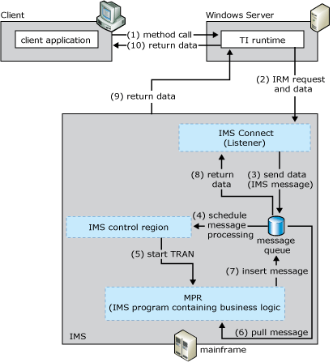

# IMS Connect
The IMS Connect programming model provides access to information management systems (IMS) transactions using TCP/IP. This model uses the IMS message queue for processing data.  
  
 The following figure summarizes the workflow occurring between the client, the default IMS Listener, the Concurrent Server, and the mainframe transaction program. The numbers in parentheses indicate the approximate order in which events occur. A more detailed description of the events follows the figure.  
  
   
Process by which the client passes input data to the ITOC listener and the HWSIMSO0 provides access to the IMS program, which delivers the response data to the client  
  
## Summary Workflow Diagram for the IMS Connect Programming Model  
 The IMS Connect programming model works as follows:  
  
1. An application invokes a method in a TI component configured in either Component Services or the .NET Framework.  
  
2. The TI runtime calls the TI Automation proxy.  
  
3. If the application is a .NET Framework assembly, the TI Automation proxy:  
  
   1. Rreads in the assembly and meta data created previously by the TI Designer.  
  
   2. Maps the .NET data types to COBOL data types.  
  
      The TI Automation proxy then:  
  
   3. Calls the conversion routines to convert the application data to mainframe COBOL types.  
  
   4. Builds the flattened data stream buffer that represents the COBOL declaration or copybook.  
  
   5. Passes the message to the TCP transport component.  
  
4. The TI runtime sends an initial request message (IRM) to the IMS Connect, either HWSIMSO0 or HWSIMSO1, using the Internet Protocol (IP) address of the mainframe computer and the port address of the IMS Connect as stored in the TCP/IP profile data set (hlq.PROFILE.TCPIP) supplied by IBM.  
  
    HWSIMSO0 and HWSIMSO1 are IBM-supplied host web server (HWS) exit routines that define the request and reply protocols between the TI Automation server (a TI .NET Framework application) and ITOC. The HWS runs in an MVS address space that is separate from the IMS regions and performs the listener services for the IMS connection.  
  
5. The IMS Connect exit routine takes control of the IMS application (referred to as the IMS TCP/IP Open Transaction Management Architecture (OTMA) Connection (ITOC)).  
  
6. The TI run-time environment sends an ITOC request header to ITOC and HWSIMSO0.  
  
7. The HWSIMSO0 exit routine:  
  
   -   Validates the ITOC request header  
  
   -   Receives all request data from the TI run-time environment  
  
   -   Communicates with security routines  
  
   -   Drives the OTMA process to connect to an IMS data store  
  
   -   Places and retrieves message segments into and from the IMS message queue through OTMA  
  
   -   Sends all reply data segments to the TI run-time environment  
  
   -   Controls recovery operations within IMS  
  
8. ITOC reads the ITOC header information, locates the correct IMS region, and schedules the execution of an IMS transaction in that IMS region. The ITOC header must contain this information:  
  
   -   ITOC HWS exit routine identifier (default '*IRMREQ\*')  
  
   -   IMS data store identifier  
  
   -   Transaction identifier  
  
   -   Flow control information  
  
   -   IBM's Resource Access Control Facility (RACF) security credentials  
  
   -   Protocol control flags  
  
9. HWSIMSO0 schedules the correct IMS message queue  
  
10. The TI run-time sends the request data segments to ITOC  
  
11. The TI run-time sends EOM  
  
12. IMS Control region sends to message processing region (MPR)  
  
13. After all request data is placed on the IMS message queue, the transaction is scheduled for execution  
  
14. The IMS server application program uses the standard CBLTDLI Get Unique (GU), Get Next (GN), and Insert (INSRT) call interface commands to retrieve the request data and to place reply data on the IMS message queue.  
  
15. MPR returns data to TI. ITOC sends EOM-CSMOKY ITOC returns the following information to the TI run-time environment:  
  
    -   Request mod message  
  
    -   Reply data segments  
  
    -   End-of-message segment  
  
    -   CSMOKY segment  
  
16. ITOC and the ITOC exit routine then remove the reply data from the message queue and deliver it back to the TI run-time environment.  
  
17. The TI Automation proxy receives the reply data and processes the reply. The TI Automation proxy:  
  
    1. receives the message from the TCP transport component.  
  
    2. reads the message buffer  
  
       If the application is a .NET Framework assembly, the TI Automation proxy:  
  
    3. maps the COBOL data types to the .NET Framework data types  
  
    4. calls the conversion routines to convert the COBOL data types to the application data  
  
18. The TI runtime sends the converted data back to the .NET Framework application that invoked the method.  
  
    For information about configuring the mainframe and writing server applications for TCP/IP, see TCP/IP V3R2 for MVS: IMS TCP/IP Application Developers Guide (IBM Document #SC31-7186) and IMS Connect Guide and Reference V1R2 (IBM Document #SC27-0946).  
  
    [!INCLUDE[hisHostIntServNoVersion](../includes/hishostintservnoversion-md.md)] includes sample code showing how to implement the IMS Connect programming model. The sample code is located at **\\**<em>installation directory</em>**\SDK\Samples\AppInt**. Start Visual Studio, open the tutorial you want to use, and follow the instructions in the **Readme**.  
  
## See Also  
 [Transaction Integrator Components](../core/transaction-integrator-components1.md)   
 [Converting Data Types from Automation to OS/390 COBOL\]](./converting-data-types-from-automation-to-os-390-cobol]2.md)   
 [Converting Data Types from OS/390 COBOL to Automation](./converting-data-types-from-os-390-cobol-to-automation2.md)   
 [IMS Components](../core/ims-components2.md)   
 [TI Runtime](../core/ti-runtime2.md)   
 [Choosing the Appropriate Programming Model](../core/choosing-the-appropriate-programming-model1.md)   
 [Programming Models](../core/programming-models2.md)