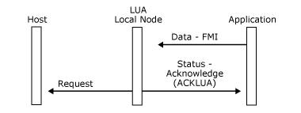
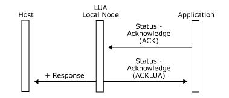

# Inbound Data from LUA Applications
The local node performs certain checks on data supplied by a client application before sending it to the host and rejects it with a [Status-Acknowledge(Nack-2)](./status-acknowledge-nack-2-2.md) message if the checks fail. It does not return any acknowledgment to the application if the data passes the checks (although the host may do so later).  
  
 If the client application is providing a logical unit application (LUA) API, the design of the API may require that an LUA verb sending data inbound to the application does not complete until the local node has checked the data. Because of this, the local node will always respond to a client application that uses the LUA variant of the function management interface (FMI), after it has completed its send checking of the inbound message. This allows the client application to complete processing of the LUA verb and return control to the LUA application program.  
  
 If the inbound message passed the local node's send checks and will be sent to the host, the local node sends a [Status-Acknowledge(ACKLUA)](./status-acknowledge-acklua-2.md) message to the client application to indicate this. The client application can then complete the LUA verb processing with an OK return code. Note that the **Status-Acknowledge(ACKLUA)** message does not imply that the data was successfully sent to the host or that the host received it. It may later be followed by a [Status-Acknowledge(Nack-1)](./status-acknowledge-nack-2-2.md) message indicating that the host rejected the data.  
  
 If the inbound message fails the local nodes send checking, a [Status-Acknowledge(Nack-2)](./status-acknowledge-nack-2-2.md) message will be returned as for non-LUA client applications. The client application can then report this to the LUA application program by a non-OK return code to the LUA verb that sent the message.  
  
 If the client application is providing an LUA API, it should therefore wait for either **Status-Acknowledge(ACKLUA)** or **Status-Acknowledge(Nack-2)** to determine whether to return an OK or error return code to the LUA send verb. If this dependence on the local node's send checks is not required, the client application can ignore the **Status-Acknowledge(ACKLUA)** message.  
  
 Note that there are certain race conditions in which the local node cannot complete its send checks before replying to the client application. In these cases, the local node returns a [Status-Acknowledge(ACKLUA)](./status-acknowledge-acklua-2.md), but may subsequently send a [Status-Acknowledge(Nack-2)](./status-acknowledge-nack-2-2.md) if it detects an error during the remaining send checks. The client application may therefore receive a **Status-Acknowledge(ACKLUA)** followed by a **Status-Acknowledge(Nack-2)** for the same inbound message.  
  
 In the transmission header (TH) for the LUA variant of FMI, the expedited flow indicator (EFI), the destination-address field (DAF), and the origin-address field (OAF) are used. Other fields (including the sequence number field) are ignored. In the RH for the LUA variant of FMI, all fields except the queued-response indicator (QRI) and pacing indicator (PI) are used.  
  
 For inbound data, the first byte is TH[0] for the LUA variant of FMI.  
  
 The following three figures illustrate the **Status-Acknowledge(ACKLUA)** acknowledgment protocol for different messages that the application can send.  
  
 In the first figure, the application sends a **Data** message that passes the local node's send checks.  
  
   
Application sends a Data message that passes the local node's send checks  
  
 In the following figure, the application sends a **Status-Acknowledge(Ack)** message that passes the local node's send checks.  
  
   
Application sends a Status-Acknowledge(Ack) message that passes the local node's send checks  
  
 In the following figure, the application sends a **Status-Acknowledge(Nack-1)** message that passes the local node's send checks.  
  
   
Application sends a Status-Acknowledge(Nack-1) message that passes the local node's send checks  
  
## See Also  
 [Outbound Data](../core/outbound-data1.md)   
 [Inbound Data](../core/inbound-data2.md)