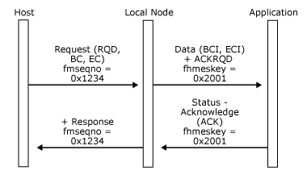
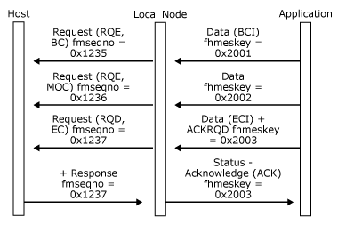
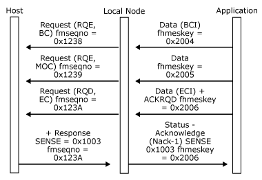
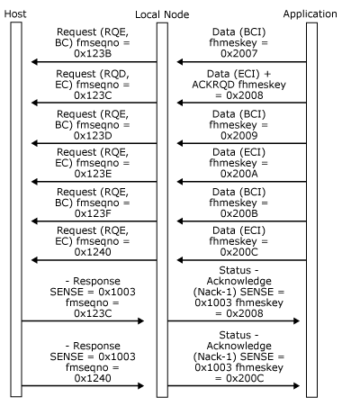
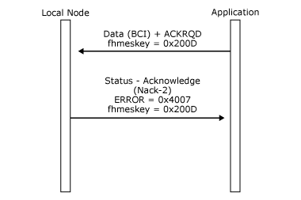

# Inbound Data
This section describes inbound data flows from the application to the local node. The overall structure of the protocols described applies to the system services control point (SSCP) and primary logical unit (PLU) connections, but more complex aspects (such as the use of delayed request mode) are only applicable to the PLU connection.  
  
 The application can send inbound data on any of the connections, as follows:  
  
- Function management data network services (FMD NS) (session services) and function management data (FMD) character-coded data intended for the host SSCP should be sent to the local node on the SSCP connection.  
  
- FMD data intended for the host PLU should be sent to the local node on the PLU connection.  
  
  The application cannot use [Data](./data1.md) messages to send data flow control (DFC) or session control request messages to the host. Instead it must use **Status-Control** messages. (For details, see [Status-Control Message](../core/status-control-message1.md).)  
  
  For all connections, the application must fill in certain key fields in the **Data** message's header. In particular it must:  
  
- Set the message-type to **DATAFMI**.  
  
- Allocate a new message key for inbound **Data** messages on this connection.  
  
- Set the **ACKRQD** field if required.  
  
- Set the application flags. (For more information, see [Application Flags](../core/application-flags1.md).)  
  
  The **nxtqptr**, **hdreptr** and **numelts** fields in the message header, and the **elteptr** and **startd** fields in the message elements are set up by the Host Integration Server buffer management routines. (For more information, see [DL-BASE/DMOD Interface](../core/dl-base-dmod-interface2.md).) The application is responsible for setting the **endd** field.  
  
  If the application does not have access to these routines (for example, when the operating environment does not support intertask procedure calls and shared memory), all the fields in the header must be set by the application.  
  
  The transmission header (TH) and response header (RH) indicators are not available to the application on inbound [Data](./data1.md) messages. The application should set the appropriate application flags in the message header to control chaining, direction, and so on. For a description of the available application flags for inbound data and later topics in this section for a description of how the flags are used to control inbound data flows, see [Application Flags](../core/application-flags1.md).  
  
  For inbound data, the first byte is RU[0] for standard function management interface (FMI).  
  
  The message key supplied by the application in the inbound **Data** message header is used by the local node to indicate which **Data** message on this connection an outbound **Status-Acknowledge** refers to. The application should maintain a unique message key sequence for the inbound data flow on each connection it has with the local node, so that the application can use the message key to correlate inbound **Data** messages and outbound **Status-Acknowledge** messages on the connection. Note that the application must also provide a message key on **Status-Control Request** messages to differentiate between multiple **RQE LUSTAT** messages.  
  
  The inbound data acknowledgment protocol reflects the secondary chain response protocol and request mode in use on the session, as follows:  
  
- Inbound [Data](./data1.md) messages with **ACKRQD** set in the header generate **RQD** requests.  
  
- Inbound **Data** messages without **ACKRQD** set in the header generate **RQE** or **RQN** requests depending on the chain response protocol.  
  
- The application should only set **ACKRQD** on **Data** messages that have the end chain indicator (ECI) application flag set.  
  
- If the session specifies that the secondary uses immediate request mode, the application can still send further **Data** messages after sending data with **ACKRQD** set, even though it has not received a **Status-Acknowledge** message for that **Data** message. The messages are queued within the local node and are progressively sent as positive responses are received.  
  
- If the session specifies that the secondary uses delayed request mode, after sending a **Data** message with **ACKRQD** set, the application can continue to send **Data** messages.  
  
  If the application sets the **ACKRQD** field in the message header of a [Data](./data1.md) message, it indicates that it requires an acknowledgment to this **Data** message. The local node acknowledges an inbound **Data** message by sending a **Status-Acknowledge** message to the application on the same connection and using the same message key as the **Data** message. (For an illustration, see the first figure at the end of this topic.)  
  
  The local node processes inbound **Data** messages from the application through its internal state computers, assigns the correct SNA sequence number or an identifier for this flow, and sends the data in a request to the host. The chain-response type of the request depends on whether **ACKRQD** was set in the **Data** message and the session parameters.  
  
  The local node maps a positive response from the host to a [Status-Acknowledge(Ack)](./status-acknowledge-ack-2.md) to the application. The application can use the message key in the **Status-Acknowledge** to correlate the acknowledgment with the original **Data** message. Therefore, receipt of a **Status-Acknowledge(Ack)** for a particular **Data** message implies that the local node has received a positive SNA response from the host to the inbound SNA request. (For an illustration, see the second figure at the end of this topic.)  
  
  Note that responses are absorbed on the SSCP-PU session.  
  
  Note that outbound [Status-Acknowledge(Ack)](./status-acknowledge-ack-2.md) messages contain application flags and a sequence number. The application flags reflect the RH indicators in the response. The sequence number is the SNA sequence number from the response, and provides a mechanism for applications using Transmission Service profile (TS profile) 4 to track the SNA secondary sequence number corresponding to a unit of work.  
  
  The local node maps a negative response from the host to a [Status-Acknowledge(Nack-1)](./status-acknowledge-nack-1-1.md) message to the application. The application can use the message key in the **Status-Acknowledge** to correlate the negative acknowledgment with the original **Data** message. The outbound **Status-Acknowledge(Nack-1)** message contains the SNA sense codes and sequence number from the negative response. (For an illustration, see the third and fourth figures at the end of this topic.)  
  
  If the local node detects an error in the format of an inbound **Data** message, or the **Data** message is not appropriate to the current state of the session, it sends a [Status-Acknowledge(Nack-2)](./status-acknowledge-nack-2-2.md) to the application containing an error code. (For a list of error codes, see [Error and Sense Codes](../core/error-and-sense-codes2.md).) The local node does not send a request to the host corresponding to the **Data** message in error and does not advance the SNA sequence number for the session. The application can use any message key in its next inbound **Data** message (assuming the error does not cause a critical failure).  
  
  An example of a serious chaining error, where the application sends a **Data** message with **ACKRQD** but without ECI in the application flags, is shown in the last figure at the end of this topic. Note that after detecting this particular error, the local node marks the application's connection as critically failed, closes the connection, and sends a **TERM-SELF** request to the SSCP to elicit an **UNBIND**. (For more information, see [Recovery](../core/recovery1.md).)  
  
  Inbound **Status-Control** messages, which cause the generation of expedited-flow requests, can be sent at any time and do not affect the sending of a positive or negative acknowledgment to inbound **Data** messages. For details about which **Status-Control** messages correspond to SNA expedited-flow requests, see [Status-Control Message](../core/status-control-message1.md).  
  
  The following five figures illustrate examples of the inbound data acknowledgment protocols (and the underlying SNA protocols) for different chain-response types and secondary session request modes.  
  
  The figures show:  
  
- The **ACKRQD** field on [Data](./data1.md) messages.  
  
- The message key on **Data** messages.  
  
- Any relevant application flags on **Data** messages.  
  
- Error codes (shown as "ERROR=...") on **Data** messages.  
  
- Relevant RH flags on SNA requests/responses.  
  
- Sequence numbers on SNA requests/responses.  
  
- Sense codes (shown as "SENSE=....") on SNA requests/responses.  
  
  For simplicity, all messages are assumed to be flowing on the same PLU session.  
  
  In the following figure, the application successfully sends a **Data** message.  
  
    
  Application successfully sends a Data message  
  
  In the following figure, the application successfully sends a chain of **Data** messages.  
  
    
  Application successfully sends a chain of Data messages  
  
  In the following figure, the host rejects a chain of **Data** messages.  
  
    
  Host rejects a chain of Data messages  
  
  In the following figure, the host rejects the first definite-response chain and rejects the third exception-response chain on a delayed request session. Note that the negative response to the third chain implies a positive response to the second chain.  
  
    
  Host rejects the first definite-response chain  
  
  In the following figure, the local node detects the application's invalid use of **ACKRQD** without the ECI application flag on a **Data** message. Note that no data is sent to the host. However, because the error is critical, the local node will send a **TERM-SELF** message to the SSCP.  
  
    
  Local node detects the application's invalid use of ACKRDQ without the ECI application flag on a Data message  
  
## See Also  
 [Outbound Data](../core/outbound-data1.md)   
 [Inbound Data from LUA Applications](../core/inbound-data-from-lua-applications1.md)