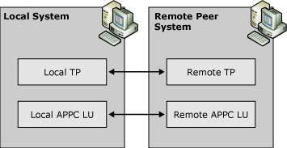

# Independent APPC LUs
In APPC, an independent LU can communicate directly with a peer system and does not need the support of a host computer<em>.</em>  
  
 Independent APPC LUs provide the ability to run multiple, concurrent, parallel sessions between a single pair of LUs. Programs that use independent APPC LUs are referred to as transaction programs (TPs) and may provide any type of service: terminal emulation, data transfer, database query or update, and so on.  
  
 The following figure illustrates how an independent local APPC LU can communicate directly with a peer system.  
  
   
Independent APPC LU communications with a peer system  
  
 Modes determine the interactions between TPs on an APPC-APPC connection. Modes can be assigned to an LU or supplied when the session is first established. For more information about modes, see [APPC Mode Definition](../core/appc-mode-definition2.md) later in this section.  
  
 When configuring independent APPC LUs, note the following:  
  
-   If the independent local APPC LU communicates with a TP on a mainframe, the host system must be using VTAM version 3, release 2 or later with either NCP version 5, release 2 or later (3745 systems), or NCP version 4, release 3 or later (3725 systems).  
  
-   For independent LUs that communicate with a host, the LOCADDR parameter should be set to 0 in VTAM or in the NCP Gen.  
  
-   On connections used for independent APPC, the exchange identification (XID) type must be Format 3.  
  
-   The Network Name parameter is required. The default is the network name of Host Integration Server.  
  
-   An LU Name parameter is required to identify local and remote APPC LUs to other components on the network. In contrast to 3270 LUs, independent APPC LUs do not need an LU number.  
  
-   If the remote APPC LU supports parallel sessions, it can only be used with a mode whose parallel session limit has a value greater than 1.  
  
## See Also  
 [Understanding Connectivity](../core/understanding-connectivity1.md)