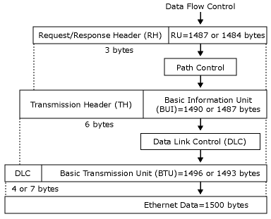

# LAN Throughput
The **100baseT** alternative to connect the Transaction Integrator (TI)/Host Integration Server computer to your host system is the most popular and currently the most available. This topic explains the bandwidth offered by **100baseT**, and the amount of that bandwidth that you can actually start using productively.  
  
## Calculating the Maximum for 100baseT  
 You can calculate the theoretical maximum in the following way for the **100baseT** Ethernet:  
  
 100BASE-T is clocked at 100 MHz, with a 25-MHz crystal multiplied by 4. The coding is 8/10, meaning one byte is packaged into 10 bits. Therefore, you can at most transfer 100/10=10 million bytes per second. To convert this number to megabytes per second (MBps), divide it in the following way:  
  
 10,000,000/(1024*1024)=9.5 MBps  
  
 Then there is the question of efficiency. Ethernet provides up to 90-95% efficiency (CSMA-CD). There is a maximum payload of about 1500 bytes per frame, and some minimum inter-frame spacing. Also, if you use half-duplex cabling, the ACK packets must take the bus sooner or later, making it almost impossible to reach the maximum.  
  
 The frame format for 802.2 over Ethernet is at maximum 1487 bytes, or 1484 depending on the Ethernet standard used IEEE, or DIX. The following figure shows the maximum RU and BTU sizes over an Ethernet.  
  
   
Data flow control showing maximum sizes over an Ethernet: 1487/1484 bytes for RU, 1490/1487 bytes for BIU, 1496/1493 for BTU, and 1500 bytes for Ethernet data  
  
 The format for TCP/IP over Ethernet is 14-byte Ethernet layer+20 IP+20 TCP+12 (TCP-timestamp)+1448 data. For each packet, the header overhead is 54/66 bytes. Of course, there are the ACK packets, one every two packets in TCP/IP. Therefore, the header overhead is three headers for two data packets, which is around 7-8%.  
  
 For 802.2 data link control (DLC) traffic, the acknowledged frequency is controlled by each end negotiating with its partner. For more information, see [SNA Communication Tuning](../core/sna-communication-tuning2.md).  
  
 For the 90–95% efficiency referred to previously, the throughput is affected by various other factors, such as the size of the broadcast domain, whether the LAN is on a switch or a hub, the number of servers sharing the segment causing possible collisions, and whether your network has other protocols whose broadcasts can consume some of the available bandwidth.  
  
 Looking at the LAN usage levels in lab tests on an isolated switched 100baseT, with only a few servers on the segment, we should be getting close to the theoretical maximum minus the known overhead. Can TI push the LAN to the maximum performance?  
  
 The test results show that when sending 32000 bytes, and receiving 32,001 bytes back, TI can drive the 100baseT close to its maximum performance if there is only minimal data conversion and no other "business logic" or processing competing with TI on the server. This is, of course, with an isolated optimized network. The backbone network in the real world must endure a lot more overhead without becoming the bottleneck for the system. To be on the safe side, a prudent design criterion for 100baseT LAN would be to keep the planned load as follows:  
  
- Less than 4 MBps for systems that mainly move data.  
  
- Less then 3 MBps for systems with short interactive transaction messages.  
  
  The reason for designing the interactive LAN load to a lower limit is due to the higher number of frames per MBps. Observing these criteria will set the peak LAN load to a safe 50% of the LAN's capacity.  
  
## See Also  
 [System Sizing](../core/system-sizing1.md)