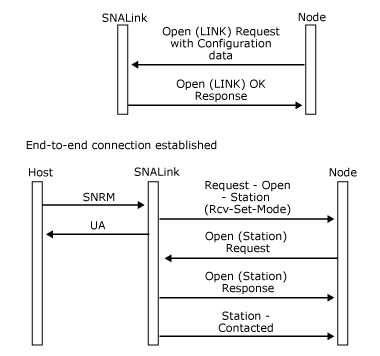

# Leased SDLC Line (No XIDs Exchanged), Channel Adapter
For a connection to a host computer using a leased synchronous data link control (SDLC) line, the SNALink receives a set normal response mode (SNRM) when the end-to-end connection is established. The SNALink responds with an unnumbered acknowledgement (UA) and informs the local node that the connection is ready for data transfer. This is done with the [Request-Open-Station](./request-open-station2.md) message with the Rcv-Set-Mode flag set.  
  
 The node then opens the STATION Locality Partner Index (LPI) connection with the [Open(STATION)](./open-station-1.md) message. If the SNALink has an available control block, it responds with an **Open(STATION) OK Response**. This is followed by a [Station-Contacted](./station-contacted1.md) message.  
  
 A channel connection is treated the same way as a leased secondary SDLC connection. Each channel connection is associated with a channel subaddress in the range 0x00 to 0xFF. The SNA service node sends the channel link service an [Open(LINK) Request](./open-link-request1.md) for each configured channel connection when the connection is activated. The link service should expect to receive multiple Open(LINK) Requests, one for each supported subchannel address.  
  
 Note that the Request-Open-Station message flows on the LINK LPI connection, whereas the Station-Contacted message flows on the STATION LPI connection.  
  
 The message flow for a leased line is shown in the following figure.  
  
   
Message flow for a leased line