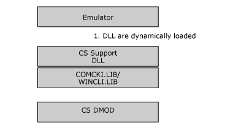

# Linking 3270 Client Applications
This topic describes how to link 3270 client applications using different platforms.  
  
 The SNACLI.LIB library must be linked with the application.  
  
 The DMOD is implemented as a DLL. SNACLI.LIB contains import definitions for the APIs in the DLL, and some global variables required for the logging and tracing macros.  
  
 It is possible to create a DLL that is dynamically loaded when the user starts a session for an LU. In this case, to make the log and trace macros available, the application structure needs to be as shown in the following figure.  
  
   
Application Structure
