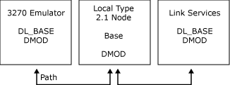

# Localities and DMODs
A Base and the components within it are called a locality. The Host Integration Server system consists of one or more communicating localities, all running Host Integration Server executable programs within the local area network (LAN) Manager domain. For each Host Integration Server system, there is a single configuration file.  
  
 In a system such as [!INCLUDE[hishostintegrationserver2009](../includes/hishostintegrationserver2009-md.md)], where the number of localities and their types are not configured in advance, the relationships between the localities are set up dynamically. Localities that can enter and leave a system in this way are called dynamic localities. Dynamic localities can enter or leave the system at any time.  
  
 Dynamic localities communicate using the Dynamic Access Module (DMOD) component, which provides the communications facilities needed to pass messages between the Bases. The following figure shows a system consisting of three dynamic localities.  
  
   
DMOD component providing communications  
  
 This figure shows a system consisting of three dynamic localities. Dynamic localities can enter or leave this system at any time.  
  
 The DMOD is implemented as a dynamic-link library (DLL). The preceding figure can therefore be represented as follows.  
  
   
DMOD implemented as a .DLL