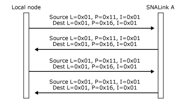

# LPI Addresses (SNADIS)
A locality, partner, index (LPI) address is used to identify each end of a connection. It has three components: locality (L), partner (P), and index (I).  
  
- **Locality** is a 1-byte identifier that uniquely identifies a locality within a system. This locality corresponds to a Host Integration Server component (local node, SNALink, 3270 emulator, and so on).  
  
- **Partner** is a 1-byte identifier for the type of service. Each type of service has a unique value. A Host Integration Server local type 2.1 node has a defined value of 0x11. A Host Integration Server emulator has a defined product identifier of 0x12. A Host Integration Server link service (X.25. SDLC, Token Ring, Ethernet, or Channel, for example) has a defined value of 0x16.  
  
- **Index** is a 2-byte identifier that uniquely identifies a logical entity within the product. The meaning and use of this field is defined by the communicating services. It is used to distinguish multiple connections between the same services (for example, to identify one of many virtual circuits available from an X.25 SNALink). The value of zero should not be used as an index. Applications must assign unique index values for every active LPI connection within the node.  
  
  A message flowing over a connection carries a pair of LPIs, identifying the source and destination of the message. These are the source LPI and destination LPI of the message. Together they identify the connection on which the message is flowing.  
  
  Note that more than one connection can exist between any pair of services. The Index values are then used to distinguish the connections. For example, in communications between the local node and a SNALink, the L and P values identify the message as being data link control (DLC) data for that local node, and the I value indicates which connection the data is intended for.  
  
  The LPIs are assigned by a combination of the products and the Dynamic Access Modules (DMODs) when the connection is opened, as described in [Making Connections (SNADIS)](../core/making-connections-snadis-2.md).  
  
  Because they are assigned dynamically for each component, the L values are not the same across a whole system. For example, a local 2.1 node locality could be known as locality 4 to one SNALink locality and locality 6 to a second SNALink locality. However, from the viewpoint of any locality, there exists a unique L value for each remote locality within which a path exists. This L value is used as an index into an internal table that identifies the path to that locality.  
  
  The following three figures show an example of the L values that could be used between the components shown in [Paths and DMODs (SNADIS)](../core/paths-and-dmods-snadis-1.md), and examples of the LPI values that would be used by the local node on messages flowing between the components.  
  
    
  Sample L values  
  
  The following figure shows L values specified on messages between the local node and SNALink A.  
  
    
  L values specified on messages between the local node and SNALink A  
  
  The following figure shows LPI values specified on messages flowing on two different connections between the local node and SNALink A.  
  
    
  LPI values specified on messages flowing on two different connections  
  
  The Base is called by any piece of code that wants to send a message. It uses the destination L value on the message to determine where to send it. When the message gets to the remote locality, the Base in that locality routes it to the appropriate service if the locality contains more than one service.