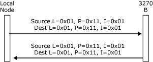
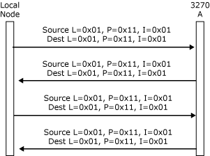

# LPI Addresses
An LPI address is used to identify each end of a connection. It has three components: locality (L), partner (P), and index (I), as described in the following list:  
  
- **Locality** is a 1-byte identifier that uniquely identifies a locality within a system. This locality corresponds to an SNA services component (local node, link service, 3270 emulator, and so on).  
  
- **Partner** is a 1-byte identifier that uniquely identifies a partner within the locality. This is not always used, but can be used to distinguish between parts of a component (for example, the 3270 functions in the local node rather than the Advanced Program-to-Program Communications (APPC) functions).  
  
- **Index** is a 2-byte identifier that uniquely identifies a logical entity within the partner. The meaning and use of this field is defined by the communicating partners. It is used to distinguish multiple connections between the same partners (for example, to identify one of many 3270 sessions between the local node and a particular 3270 emulator). The value of zero should not be used as an index value. Applications must assign unique index values for every active LPI connection with the node.  
  
  A message flowing over a connection carries a pair of LPIs that identify the source and destination of the message. These are the source LPI and destination LPI of the message. Together they identify the connection on which the message is flowing.  
  
  More than one connection can exist between any pair of partners. The I values are then used to distinguish the connections. For example, in communications between the local node and a 3270 emulator, the L and P values identify the message as being 3270 data for that local node, and the I value indicates which session the data is intended for.  
  
  The LPIs are assigned by a combination of the partners and the DMODs when the connection is opened, as described in [Making Connections](../core/making-connections1.md).  
  
  Because they are assigned dynamically for each component, the L values are not the same across an entire system. For example, a local 2.1 node locality could be known as locality 4 to one 3270 locality, and locality 6 to a second 3270 locality. However, from the viewpoint of any locality, there exists a unique L value for each remote locality within which a path exists. This L value is used as an index into an internal table that identifies the path to that locality.  
  
  The following figures show an example of the L values that could be used between the components shown in [Paths and DMODs](../core/paths-and-dmods2.md), and examples of the LPI values that would be used by the local node on messages flowing between the components. (For more information about how the LPI values are assigned and used, see [Opening the PLU Connection](../core/opening-the-plu-connection1.md).)  
  
    
  Example L values  
  
  **Example L values**  
  
    
  L values specified on messages between the local node and 3270 B  
  
  **L values specified on messages between the local node and 3270 B**  
  
    
  LPI values specified on messages flowing on two different connections between the local node and 3270 A  
  
  **LPI values specified on messages flowing on two different connections between the local node and 3270 A**  
  
  The Base is called by any piece of code that wants to send a message. It uses the destination L value on the message to determine where to send it. When the message reaches the remote locality, the Base in that locality routes it to the appropriate partner if the locality contains more than one partner.