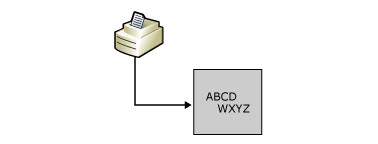

# LU 3 Printing
LU 3 printing is the simplest of the three types of host printing. The LU 3 data stream closely resembles that for 3270-display emulation. It consists of a write command code and a write control character (WCC) followed by the print job. These print jobs contain printable characters and only four simple formatting orders (new line, form feed, carriage return, and end of medium). No other control of the print output is available. This form of printing is similar to printing a text file from a personal computer. If more print formatting is required, an LU 1 print session should be used. For more information, see the section [LU 1 Printing](../core/lu-1-printing1.md).  
  
 In SNA Manager, the 3270 Print Session properties Page Layout tab includes specifications for the number of characters per line and the number of lines per inch. Host print jobs using the LU 3 data stream also provide defaults for these parameters. The defaults may be different depending on the settings.  
  
 For LU 3, the settings in the host print job normally override the Print Service session settings. However, if you leave the host settings at their defaults of 6 lines per inch and 132 columns per row, the Print service session settings are used.  
  
 After the defaults for lines per inch and page width have been determined, the Print service chooses a font for the print job that will accommodate this size print output on the paper loaded in the printer.  
  
 There are no transparent sections in LU 3 print jobs, so Transparency is ASCII does not apply. LU 3 print jobs do not have SCS codes, but do have NL, CR, FF, and LF characters and do have commands to allow you to position print data on the page. The Print service uses these to build an internal representation of the page before printing it out. When a PDT file is used, Print service uses the definitions of NL, CR, FF, and LF from the PDT file to allow it to format the printout correctly. If no PDT file is configured, Print service uses the Windows GDI.  
  
## Command Code  
 The write command codes are not unique values, but are identified by occupying the first byte in the Request Unit (the message format used in an SNA network, also known as an RU). In addition there can be only one command code per RU. For LU 3 printing, the most commonly used command code is Erase/Write '0xF5'. Read command codes, which would be normal for display sessions, are not valid for LU 3 printing, and will be rejected with a sense code of '1003'.  
  
## Write Control Character (WCC)  
 Following the write command code is the write control character (WCC). This byte is also identified by its position, second byte in the RU. With LU 3 printing, bits 2 and 3 of the WCC define the printout format.  
  
### Write Control Character (WCC) Codes  
  
|Bit|Explanation|  
|---------|-----------------|  
|0,1|Ignored by the printer.|  
|2,3|Defines printout format.|  
|none|00 NL or CR orders define the print line length, EM indicates the end of the message.|  
|none|01 Indicates 40-character lines.|  
|none|10 Indicates 64-character lines.|  
|none|11 Indicates 80-character lines.|  
|4|Start-printer bit.|  
|6|Keyboard reset.|  
|7|Reset MDT bit.|  
  
## Format Control Orders  
 There are four control codes used only for printing known as Format Control Orders.  
  
### Format Control Orders  
  
|Abbreviation|Order|EBCDIC|  
|------------------|-----------|------------|  
|NL|New Line|0x15|  
|EM|End of Medium|0x19|  
|FF|Form Feed|0x0C|  
|CR|Carriage Return|0x0D|  
  
 NL, CR, and EM are valid only when the write operation does not specify a line length format in the WCC byte. FF is valid in any write operation.  
  
## 3270 Orders  
 The 3270 data stream can contain sequences, called 3270 Orders, which provide additional control functions. The two most commonly used in LU 3 printing are Set Buffer Address (SBA) and Repeat to Address (RA). Note that the buffer address used in these commands is relative to each write. The print buffer in LU 3 allows a maximum of 4 KB of data, and often only 2 KB. This may require multiple write commands to be sent for a full page of text. The first write command will start at the top of the page. Its first buffer address will also be at the top of the page. Subsequent writes will continue where the first left off. Their first buffer address will also start where the previous write ended, unless it was ended with a form feed. For the examples below, it is assumed that these are the first write commands.  
  
 SBA is indicated by a '0x11' followed by a two-byte buffer address. This order sets the cursor position to the location specified in the two-byte buffer address. In LU 3 printing, this sets the print position. The data following the SBA will be printed starting from this location. For example:  
  
 114040          Sets the print position to row 1 and column 1.  
  
 RA is indicated by a '0x3C' followed by a two-byte stop buffer position and the character to be repeated. This order causes a character to be repeated from the current buffer address up to but not including the stop buffer address specified in the RA. For example:  
  
 3C40D3C1      Repeats the character 'A' ('0xC1') to row 1 and column 20.  
  
## Data  
 For LU 3 printing the data or printable characters must have values between '0x40' and '0xFE'. The only valid values outside this range are the 3270 Orders.  
  
 Example: 15C1C2C3       Prints a new line followed by 'ABC'  
  
 Example: 1BC1C2C3       Rejected because '0x1B' is an invalid value  
  
 **Sample Host Data**  
  
 Following is sample data from a host along with an explanation of the data and resulting printout.  
  
```  
F5C81140 40151515 C1C2C3C4 15404040   
E6E7E8E9 19  
  
```  
  
 This sample data is analyzed in the following table.  
  
### 3270 LU 3 Sample Data  
  
|Data|Interpretation|  
|----------|--------------------|  
|F5|Command code Write/Erase|  
|C8|WCC with bits 2, 3 specifying that NL, EM and CR orders determine the print line length.|  
|114040|SBA sets print position to row 1 column 1|  
|15|New line|  
|15|New line|  
|15|New line|  
|C1C2C3C4|EBCDIC hex values for ABCD|  
|15|New line|  
|404040|EBCDIC hex values for three spaces|  
|E6E7E8E9|EBCDIC hex values for WXYZ|  
|19|End Medium|  
  
   
Print output from the sample data in the preceding table. ABCD on top print line and WXYZ indented on lower line.  
  
## See Also  
 [Host Print Service (Operations)](../core/host-print-service-operations-2.md)