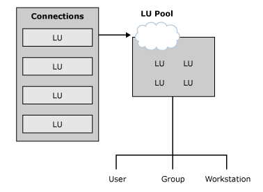

# LU Pools (3270)
Although you can create individual LUs and assign them to users and groups, using LU pools to manage and deploy a large number of LUs is a more efficient method of administering these resources. LU pools are groupings of LUs that allow you to maximize access to these LUs. As shown in the following illustration, a user, an application, or a downstream system can access the LUs as long as any LU assigned to the pool is free. If any one of the pooled LUs ceases to function, another free LU in the pool is automatically used.  
  
   
Diagram of creating and assigning LU pools  
  
## Creating and assigning LU pools  
 LU pools also allow groups of intermittent users to use a limited number of host resources more efficiently. Dedicating LUs to specific users who occasionally require host access wastes host resources. Using a pool, you can assign a smaller number of LUs to a group of users who require sporadic access. For example, if a group of 100 users require host access 25 percent of the time, assigning a pool of 25 LUs to the group may fulfill their needs.  
  
## See Also  
 [Assigning LUs to Workstations (3270)](../core/assigning-lus-to-workstations-3270-1.md)   
 [Providing Hot Backup and Load Balancing (3270)](../core/providing-hot-backup-and-load-balancing-3270-1.md)   
 [Deployment Strategies (3270)](../core/deployment-strategies-3270-1.md)
