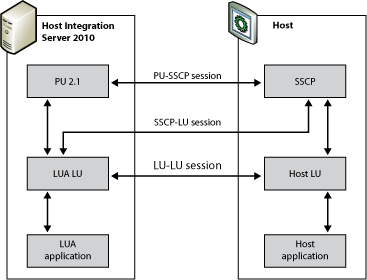

# LUs and Sessions
The following figure shows the SNA components required for logical unit application (LUA) communications.  
  
   
SNA components required for LUA communications  
  
 An LUA application uses a local LU, which uses Host Integration Server to communicate with the host system. There are three progressive sessions when Host Integration Server connects to the host node:  
  
- The PU-SSCP session, between the Host Integration Server physical unit (PU) and the host's system services control point (SSCP). This is used mainly for diagnostic information. LUA communications require only the capabilities of PU 2.0. Host Integration Server provides these capabilities, plus the additional capabilities included in PU 2.1.  
  
- The SSCP-LU session, between the LUA LU at the computer and the SSCP. This is used for controlling the LU.  
  
- The LU-LU session, between the LUA LU at the computer and the host LU. This is used for data transfer between the computer and the host application.  
  
  LUA allows applications to send and receive data on the SSCP-LU session and on the LU-LU session. An LUA application can send data on this session using the common service verb [TRANSFER_MS_DATA](./transfer-ms-data2.md). LUA does not provide access to the PU-SSCP session.  
  
  The SSCP and LU sessions each provide two priorities of messages, normal and expedited. Expedited messages take precedence over other messages waiting to be transmitted on the same session. There are four different flows on which a message can be sent or received:  
  
- SSCP session (expedited flow)  
  
- LU session (expedited flow)  
  
- SSCP session (normal flow)  
  
- LU session (normal flow)  
  
  The LU session normal flow carries most of the data. The other flows are used only for control purposes.  
  
> [!NOTE]
>  The implementation of LUA in Host Integration Server does not allow applications to send data on the SSCP expedited flow and does not return data to an application on this flow.