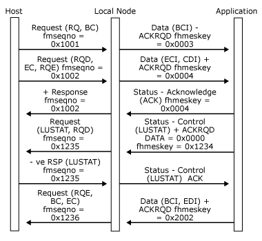
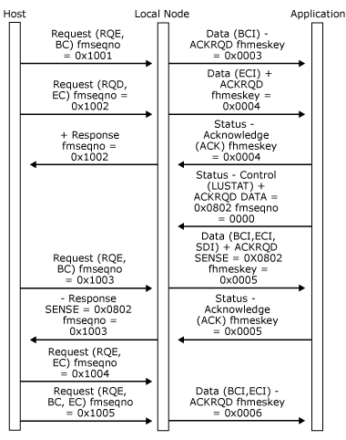
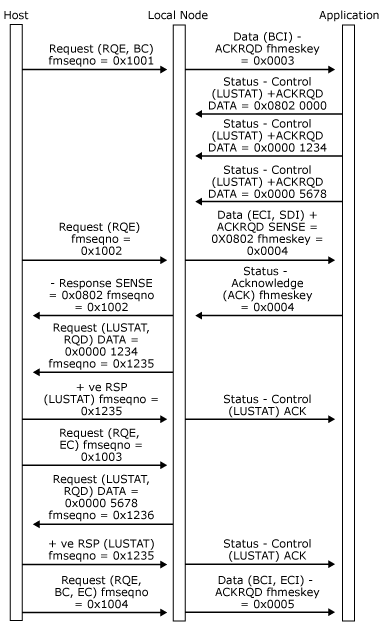

# LUSTATs]
The data flow control (DFC) logical unit status **LUSTAT** message is used within SNA to convey four bytes of sense data to the other session partner. It can also be used simply to send a response header (RH) to the other session partner (for example, to open a bracket). (For more information, see the figures in [Bracket Initiation](../core/bracket-initiation.md).) The message flows on the normal flow and so is subject to direction restrictions. However, it can be sent without end bracket (EB) or change direction (CD) on a half-duplex flip-flop session that is in error recovery pending state. (For more information, see [Recovery](../core/recovery.md).)  
  
 The local node allows the application to send **Status-Control(LUSTAT) Request** messages at any time that data traffic is active, except while sending data in chain. If the application is in a receiving state (using half-duplex protocol), the **LUSTAT** is queued up and used to provide the sense codes, which are filled into the next outbound request, and the SDI flag is set. The application can therefore present the sense codes for an error state without waiting for the next outbound data if required.  
  
 The first byte of sense data must be 0x08 to generate a **DATAFMI** message with **SDI** (to be converted to a negative response). Other **LUSTATs** are left queued on the session until they can be sent.  
  
 If multiple **Status-Control(LUSTAT)** messages are sent by the application while in a receive state, the local node queues them all. When outbound data has been delivered to the application with **SDI** set, as indicated earlier, and the application has converted it to a [Status-Acknowledge(Ack)](../Topic/Status-Acknowledge\(Ack\)1.md), the local node sends the negative response and the remaining **LUSTATs** (which can now flow because the half-duplex flip-flop state is error recovery pending).  
  
 If the application intends to send multiple **Status-Control(LUSTAT)** messages to the host, it is possible that the host will attempt to initiate recovery before the last **LUSTAT** has been sent. In this case, the error recovery chain will be rejected by the next **LUSTAT**.  
  
 Note that the application can send **Status-Control(LUSTAT) Request** with or without **ACKRQD**. The local node will map these to **RQD** and **RQE LUSTATs** respectively.  
  
 The following three figures illustrate the use of **Status-Control(LUSTAT)** messages by an application using the half-duplex flip-flop mode.  
  
 In the first figure, the application issues **Status-Control(LUSTAT)** when it has direction.  
  
   
Application issues Status-Control(LUSTAT) when it has direction  
  
 In the following figure, the application sends **Status-Control(LUSTAT)** request when receiving data between chain. Next, outbound data is delivered with **SDI** set, which gets converted to negative **RSP**.  
  
   
Application issues Status-Control(LUSTAT) request when receiving data between chain  
  
 In the following figure, the application sends several **Status-Control(LUSTAT)** requests when receiving data in chain. Next, outbound data is delivered with **SDI** set which gets converted to negative response. Subsequent **LUSTATs** are sent to host.  
  
   
Application sends several Status-Control(LUSTAT) requests when receiving data in chain  
  
## See Also  
 [Opening the PLU Connection](../core/opening-the-plu-connection.md)   
 [Closing the PLU Connection](../core/closing-the-plu-connection.md)   
 [PLU Session](../core/plu-session.md)   
 [Outbound Chaining](../core/outbound-chaining.md)   
 [Inbound Chaining](../core/inbound-chaining.md)   
 [Segment Delivery](../core/segment-delivery.md)   
 [Brackets](../core/brackets.md)   
 [Direction](../core/direction.md)   
 [Pacing and Chunking](../core/pacing-and-chunking.md)   
 [Confirmation and Rejection of Data\]](../core/confirmation-and-rejection-of-data].md)   
 [Shutdown and Quiesce](../core/shutdown-and-quiesce.md)   
 [Recovery](../core/recovery.md)   
 [Application-Initiated Termination](../core/application-initiated-termination.md)   
 [Response Time Monitor Data](../core/response-time-monitor-data.md)