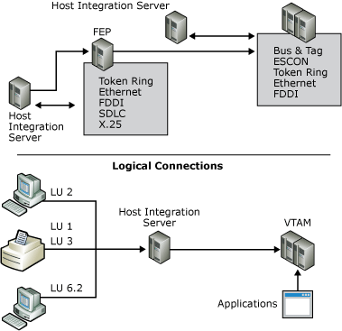

# Mainframe Connection Summary
The hierarchical SNA network model provides access to a centralized processing resource from elements on the network. This model is most frequently associated with mainframe environments in which centralized applications are accessed from remote terminals across a network.  
  
 Devices in a hierarchical SNA network, such as terminals or cluster controllers, are called physical units (PUs). A number designates each class of device. For example, the mainframe is known as a PU 5 device.  
  
   
Diagram of network model showing Host Integration Server connecting to a mainframe and to a front-end processor. Also shows supported protocols.  
  
 Host Integration Server can directly connect to the mainframe if a high-performance connection is required. These physical connection methods are available:  
  
- Open Systems Adapter, supporting Token Ring, Ethernet, and Fiber Distributed Data Interconnect (FDDI) connections  
  
- Bus & Tag channel connection  
  
- Enterprise System Connection (ESCON) channel connection  
  
  Connections to a front-end processor (FEP), which is a PU 4 device, are also supported. These types of connections may be easier to implement depending on your existing infrastructure and the physical proximity of the Host Integration Server to the mainframe. For an FEP, you can use one of the following connection methods:  
  
- Token Ring  
  
- Ethernet  
  
- FDDI  
  
- SDLC  
  
  In a hierarchical SNA network, Host Integration Server emulates a cluster controller and supports all standard protocols:  
  
- LU 2, for 3270 terminal sessions  
  
- LU 1 or 3, for SCS or 3270 printer sessions  
  
- LU 6.2, for Advanced Program-to-Program Communications (APPC) and Common Programming Interface for Communications (CPI-C) applications  
  
- LU 0, 1, 2, or 3, for logical unit application (LUA) RUI/RI general-purpose, customized applications  
  
  Any combination of these protocols can be used over a given physical connection.  
  
## See Also  
 [Choosing Server-to-Host Connections](../core/choosing-server-to-host-connections1.md)   
 [AS/400 Connection Summary](../core/as-400-connection-summary1.md)