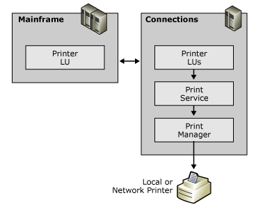

# Mainframe Printing

##LU1 and LU3 data streams
Mainframe printing supports both LU 1 and LU 3 data streams. It also includes pass-through support from the host for Intelligent Printer Data Stream (IPDS). Using IPDS, mainframe print jobs can be printed on LAN printers without changing either the print job or the host application.  

Connections between mainframe printing and local printer:  
   
  
Host Print service provides print emulation for three LU types: LU 3, LU 1, and LU 6.2 (APPC). The LU type defines the characteristic of the host data stream. LU 3 and LU 1 printing use a 3270 data stream over a session to a mainframe. APPC printing uses a LU 6.2 data stream over a session to an IBM AS/400. The following sections provide an overview of LU 3 and LU 1 printing. APPC printing is discussed under the AS/400 section later in this section.  
  
The Host Print service must run in a user account that has permission to access the defined network printer (or printers). For example, if you are printing to a printer attached to a Windows server computer, the Host Print service must run in an account that is recognized by Windows Active Directory.  
  
## See Also  
 [Host Print Service (Operations)](../core/host-print-service-operations.md)