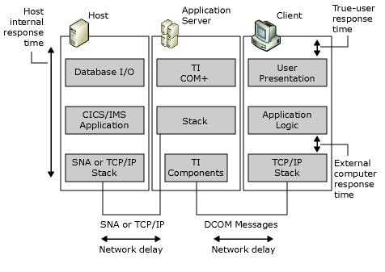

# Major Elements Affecting Overall Performance
Several factors contribute to the total user response time, often called the *response time budget*. To analyze the total system response time more easily, divide the response time into the parts of the system that play a major role in the total response time budget. The following figure shows the main divisions.  
  
   
Three main divisions -- host, application server, and client --showing how response time is affected by at least three levels within each division and by the network response time between divisions  
  
 When you are benchmarking the interactive performance of computers executing a transaction program (TP) on the host, several response time and resource figures are of primary value. These include the host internal response time, external computer response time, network delays, and the true user response time, CPU use, and transaction rates.  
  
## In This Section  
 [Host Internal Response Time](../core/host-internal-response-time1.md)  
  
 [External Computer Response Time](../core/external-computer-response-time1.md)  
  
 [Network Delay](../core/network-delay1.md)  
  
 [True User Response Time](../core/true-user-response-time2.md)  
  
## See Also  
 [Transaction Integrator Performance Guide](../core/transaction-integrator-performance-guide1.md)
