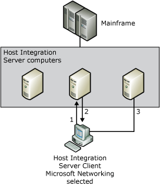

# Named Pipes Clients
  
Diagram showing how a Microsoft Networking client can connect to the mainframe  
  
 A Microsoft Networking (Named Pipes) client uses the following procedure for connecting to the mainframe:  
  
1. You can choose between two methods by which a client searches for [!INCLUDE[hisHostIntServNoVersion](../includes/hishostintservnoversion-md.md)] computers.  
  
   - Active Directory  
  
   - Sponsor connections, locating servers by SNA subdomain or by server name.  
  
     **Client locates servers by subdomain** means that the client locates the server through broadcasts in the local subdomain. Therefore, the client must be in the same physical network as the [!INCLUDE[hisHostIntServNoVersion](../includes/hishostintservnoversion-md.md)] computers, and must not be separated from the servers by a router.  
  
     **Client locates servers by name** means that the client searches for Host Integration Server computers by name, and therefore need not be on the same side of any routers as the Host Integration Server computers. When connecting with Named Pipes over TCP/IP, and there is a router separating the Host Integration Server computer and the client, the client computer requires a method of resolving NetBIOS names to an IP address. A local LMHOSTS file or a Windows Internet Name Service (WINS) server may be used to perform this resolution.  
  
     If this is a routed network, Named Pipes is not recommended. TCP/IP is the recommended interface for this environment.  
  
2. The Host Integration Server computer responds with a list of available Host Integration Server computers that are available to get a 3270 or APPC session with. This special connection is called the sponsor connection.  
  
3. Finally, the client attempts to connect to each Host Integration Server computer in the list until a server is found that can handle the 3270 or APPC request.  
  
## In This Section  
 [Microsoft Networking (Named Pipes) Errors](../core/microsoft-networking-named-pipes-errors2.md)  
  
## See Also  
 [Details about How Clients Use Protocols](../core/details-about-how-clients-use-protocols1.md)