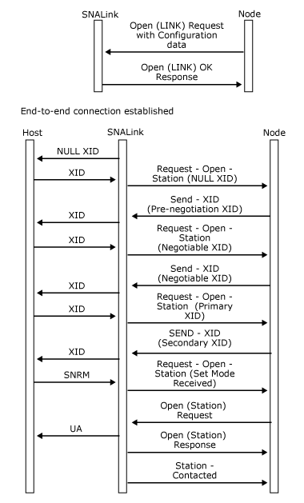

# Negotiable Link Roles
The following figure shows the sequence of messages for a peer connection where both the local and remote ends are configured as negotiable. Because the remote node identifier is larger (numerically) than the local node identifier, the remote station will become primary.  
  
   
Sequence of messages for a peer connection where both ends are configured as negotiable  
  
|||  
|-|-|  
|local node identifier|= 0x05D11111|  
|remote node identifier|= 0x05D22222|  
  
 The following summaries the rules that the SNALink must follow when supporting exchange identification (XID) exchange, and in particular XID role negotiation:  
  
- If an XID is supplied in the [Open(LINK) Request](./open-link-request1.md), it must be transmitted as soon as the end-to-end connection is established for primary or negotiable links.  
  
- All XIDs received from the remote station must be passed to the local node in a [Request-Open-Station](./request-open-station2.md) message.  
  
- An XID received from the local node in a [Send-XID](./send-xid1.md) message must be transmitted immediately.  
  
- XID transmissions must be retried until an XID is received from the remote station. For half-duplex links, the retry time-out should be randomized to prevent repeated XID clashes.  
  
- When a mode-setting command, such as set normal response mode (SNRM), QSM, or set asynchronous balanced mode extended (SABME), is received before the station has been opened, a Request-Open-Station must be sent to the local node with the Rcv-Set-Mode flag on.  
  
- When the local node sends an [Open(STATION)](./open-station-1.md) message, the link should examine it to determine its link role (that is, primary or secondary).  
  
- A secondary station should send a [Station-Contacted](./station-contacted1.md) message after receiving and responding to the **Open(STATION)** message.  
  
- For a primary station, the mode-setting command should be sent when the **Open(STATION)** message is received. The Station-Contacted message should be sent to the local node when this command has been acknowledged by the secondary station (for instance, an unnumbered acknowledgement (UA) received on an Synchronous Data Link Control (SDLC) link).  
  
  If the local node detects an error during role negotiation, such as both physical units (Pus) configured as primary, it sends out an XID containing an error vector. The vector is appended to the end of the normal XID data. The vector number specified is 0x22, and the vector data specifies that the data link control (DLC) role field is in error.  
  
  After sending the error XID, the local node sends a **Close(LINK)** message to terminate the connection (see [Closing a Connection](../core/closing-a-connection-snadis-1.md)).  
  
  The following table is a matrix of the possible combinations of station link roles and shows the eventual role of the local station.  
  
|                              | Local Station  |
|------------------------------|----------------|
| **Remote**  **Station** |                |
|                              |  **Primary**   |
|                              | **Secondary**  |
|                              | **Negotiable** |
  
 *The station with the higher node identifier becomes the primary.