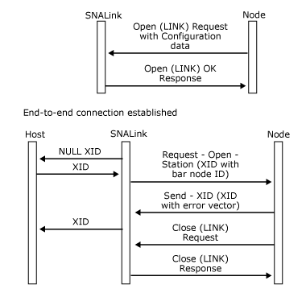

# Node Identification and Signaling Information
For information about the role an SNALink plays in node identification, see [Incoming Call Support](../core/incoming-call-support-snadis-2.md).  
  
 When exchange identifications (XIDs) are exchanged, there are two mechanisms for identifying the remote station:  
  
- The node identifier on received XIDs.  
  
- The data link control (DLC) defined address; for example, the media access control (MAC) address. This is known as signaling information.  
  
  The presence of signaling information depends on the type of the SNALink. For instance, there is no signaling information over a Synchronous Data Link Control (SDLC) link, but there is signaling information over X.25 and 802.2. The SNALink passes signaling information to the local node on the [Request-Open-Station](./request-open-station2.md) message by appending it after the XID.  
  
  If signaling information is present, the local node checks it against the configured value in the dial-digits record of the Host Integration Server configuration file. For incoming call support, this allows the local node to determine the connection that is to be activated. For a fuller description of incoming calls, see [Incoming Call Support](../core/incoming-call-support-snadis-2.md).  
  
  If there is no signaling information, the local node compares the control point (CP) name on the received XID with the remote control point name in the configuration.  
  
  If the remote station is identified correctly, XID exchange proceeds as detailed in [Activating a Peer Connection](../core/activating-a-peer-connection-snadis-1.md). However, if there is a mismatch, the local node sends an XID (in the [Send-XID](./send-xid1.md) message) containing an error vector followed by a [Close(LINK) Request](./close-link-request1.md), as shown in the following figure.  
  
    
  Local node sending an XID containing an error vector, followed by a Close(LINK) Request