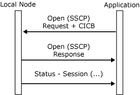

# Opening the SSCP Connection
An application gains access to the system services control point (SSCP) session by opening an SSCP connection to the local node. To do this, an application sends an [Open(SSCP) Request](../Topic/Open\(SSCP\)%20Request1.md) message to the local node, which responds with an [Open(SSCP) Response](../Topic/Open\(SSCP\)%20Response2.md). The local node follows a positive **Open(SSCP) Response** with a [Status-Session](../Topic/Status-Session1.md) message reporting the current state of the SSCP session. (For more information, see [Using the SSCP Session](../core/sscp-session.md).)  
  
 The following figure shows the message flow. For a figure showing a more detailed message flow, including locality, partner, index (LPI) values used during initialization of both the SSCP and primary logical unit (PLU) sessions, see [Opening the PLU Connection](../core/opening-the-plu-connection.md).  
  
   
Message flow between a local node and an application  
  
## In This Section  
  
-   [LU Groups](../core/lu-groups.md)  
  
-   [Resource Location for Open SSCP](../core/resource-location-for-open-sscp.md)