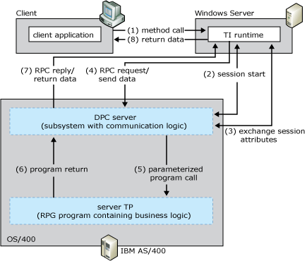

# OS/400 Distributed Program Calls
The OS/400 Remote Command and Distributed Program Calls (DPC) programming model allows most AS/400 applications to interact with TI in request-reply fashion (client-initiated only) with minimum modifications. DPC is a documented protocol that supports program to program integration on an AS/400, which can be accessed easily from PC based applications using the TCP/IP networking protocol.  
  
> [!NOTE]
>  This interface does not support host-initiated processing (HIP); AS/400 integration is for client-initiated calls only.  
  
 The following figure summarizes the workflow occurring between the client, the default DPC Server, and the AS/400 transaction program. The numbers in parentheses indicate the approximate order in which events occur. A more detailed description of the events follows the figure.  
  
   
AS/400 model flow  
  
## Summary Workflow Diagram for the OS/400 DPC Programming Model  
 The OS/400 DPC programming model works as follows:  
  
1. An application invokes a method in a TI component configured in Component Services or the .NET Framework.  
  
2. The TI runtime calls the TI Automation proxy.  
  
3. If the application is COM+ component, the TI Automation proxy:  
  
   1. Reads in the type libraries previously created by the TI Designer.  
  
   2. Maps the automation data types to AS/400 RPG data types.  
  
      If the application is a .NET Framework assembly, the TI Automation proxy:  
  
   3. Reads in the assembly and metadata previously created by the TI Designer.  
  
   4. Maps the .NET Framework data types to AS/400 RPG data types.  
  
      The TI Automation proxy then:  
  
   5. Calls the conversion routines to convert the application data to AS/400 RPG types.  
  
   6. Builds the parameterized message buffer that represents the RPG PLIST.  
  
   7. Passes the message to the AS/400 DPC transport component.  
  
4. The TI TCP transport sends a connection request to the DPC Server system using the Internet Protocol (IP) address of the AS/400 computer and the port address of the server. The TI TCP transport then waits for a reply.  
  
5. The DPC Server on the AS/400 accepts the session request and issues a receive. The DPC Server then waits for the start server request.  
  
6. The TI automation proxy sends the DPC Server a start server request and issues a receive. The TI TCP transport then waits for a start server reply.  
  
7. The DPC server processes the start server request, sends a start server reply, and then issues a receive. The DPC Server then waits for an exchange attributes request.  
  
8. The TI runtime processes the start server reply, sends the attributes request, and issues a receive. The TI runtime then waits for an exchange attributes reply.  
  
9. The DPC server processes the exchange attributes request, sends a exchange attributes reply, and then issues a receive. The DPC then waits for a remote program call  request.  
  
10. TI runtime processes the exchange attributes reply and then sends remote program call request followed immediately by remote program call reply and the converted data.  
  
11. The DPC server processes the request, sends remote program call reply followed by remote program call parameters and data.  
  
12. The TI Automation proxy receives the reply data and processes the reply. The TI Automation proxy:  
  
    1. Receives the message from the TCP transport component.  
  
    2. Reads the message buffer.  
  
       If the application is a COM+ component, the TI Automation proxy:  
  
    3. Maps the OS/400 data types to the automation data.  
  
    4. Calls the conversion routines to convert the OS/400 RPG types to the application data.  
  
       If the application is a .NET assembly, the TI Automation proxy:  
  
    5. Maps the AS/400 data types to the .NET Framework data types.  
  
    6. Calls the conversion routines to convert the OS/400 RPG types to the application data.  
  
13. The TI runtime sends the converted data back to the COM or .NET Framework application that invoked the method.  
  
    > [!NOTE]
    >  The maximum size of a message is 32,767 bytes, including field headers and data.  
  
    > [!NOTE]
    >  The RMTPGMCALL can pass maximum 35 parameters as IN or OUT, or as IN/OUT in any combination.  
  
    [!INCLUDE[hisHostIntServNoVersion](../includes/hishostintservnoversion-md.md)] includes sample code showing how to implement the IMS Connect programming model. The sample code is located at **\\**<em>installation directory</em>**\SDK\Samples\AppInt**. Start Microsoft Visual Studio, open the tutorial you want to use, and follow the instructions in the **Readme**.  
  
    For information about configuring the mainframe and writing server applications for IBM AS/400e, see the ILE RPG/400 Programmers Guide Version 4 (IBM Document #SC09-2507-02) and the ILE RPG/400 Reference Version 3 (IBM Document #SC09-2077-01).  
  
## See Also  
 [Transaction Integrator Components](../core/transaction-integrator-components1.md)   
 [Converting Data Types from RPG to Automation](./converting-data-types-from-rpg-to-automation1.md)   
 [Converting Data Types from Automation to RPG](./converting-data-types-from-automation-to-rpg1.md)   
 [AS/400 Security](./as-400-security1.md)   
 [COMTIContext Interface](./comticontext-interface2.md)   
 [TI Runtime](../core/ti-runtime2.md)   
 [Choosing the Appropriate Programming Model](../core/choosing-the-appropriate-programming-model1.md)   
 [Programming Models](../core/programming-models2.md)