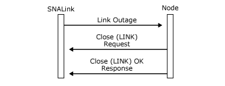

# Outages (SNADIS)
If the SNALink detects a link or station failure, it reports the failure by sending an [Outage](./outage2.md) message to the node on either the LINK or STATION LPI connection depending on whether it is a link or station outage. Generally, a station outage indicates a problem at the remote station, and a link outage indicates a local or line problem.  
  
 When the local node receives an Outage message, it:  
  
- Logs an error containing the outage code.  
  
- Cleans up each session using the connection and informs applications of the failure (for instance, with a Comm Check code on a 3270 emulator).  
  
- Sends a [Close(LINK) Request](./close-link-request1.md) to the SNALink.  
  
  On receipt of the **Close(LINK) Request**, the SNALink should clear up its internal resources for the connection and send back a [Close(LINK) Response](./close-link-response2.md).  
  
    
  Local node receiving an Outage message and sending a Close(LINK) Request and a Close(LINK) response  
  
  There is a special case when the node loses contact with the SNALink software. In this case, the node is notified of this event (a lost locality) and performs outage processing apart from sending messages to the SNALink.  
  
  The outage codes are not distinguished by the node, but they are logged. For the sake of consistency across SNALink implementations, the values listed in the following topics should be used.  
  
## In This Section  
  
-   [SDLC Outage Codes](../core/sdlc-outage-codes2.md)  
  
-   [X.25 Outage Codes](../core/x-25-outage-codes2.md)