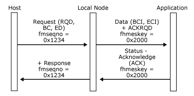
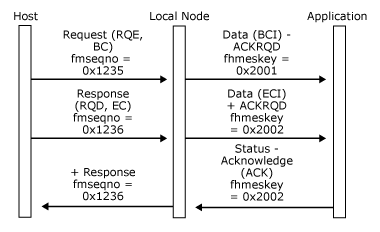
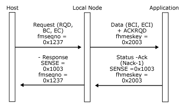
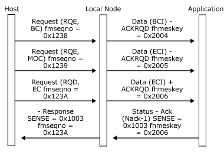
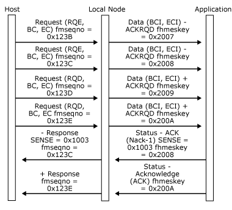
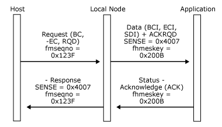

# Outbound Data
This section describes the outbound data flows from the local node to the application. The overall structure of the protocols described applies to the system services control point (SSCP) and primary logical unit (PLU) connections, but certain features (such as the use of delayed request mode) are only applicable to the PLU connection.  
  
 The local node presents data originating at the host to the application on different connections, depending on the SNA session on which the data flows, as follows:  
  
- Function management data network services (FMD NS) (session services) data and function management data (FMD) originating at the host SSCP and directed to the Host Integration Server logical unit (LU) is sent to the application on the SSCP connection.  
  
- FMD data originating at the host PLU and directed to an SNA server LU is sent to the application on the PLU connection.  
  
  For all connections, only FMD requests are presented to the application as [Data](./data1.md) messages (with message-type = DATAFMI). DFC and session control requests are used to generate **Status-Control** messages. (For more information, see [Status-Control Message](../core/status-control-message1.md).)  
  
  The local node performs the data flow control state changes required by the response header (RH) indicators in the request, before sending a **Data** message to the application.  
  
  The SNA request transmission header (TH) and RH indicators are not available to the application on outbound **Data** messages. Instead, the local node provides application flags in the **Data** message header that reflect the settings of a subset of the RH indicators, but are interpreted by the local node to shield the application from the more obscure aspects of chaining and bracket usage. For a description of the available flags and the way in which the local node uses them on outbound data, see [Application Flags](../core/application-flags1.md).  
  
  For outbound data, the first byte is RU[0] for standard function management interface (FMI), and TH[0] for the logical unit application (LUA) variant of FMI.  
  
  All [Data](./data1.md) messages from the local node to an application contain a message key. The local node maintains a unique message key sequence for each outbound data flow to an application. When the local node sends a **Data** message to an application on a particular connection, it places the next message key in the outbound sequence into the message header, sets the application flags, and sends the message to the application. This means that the message key uniquely identifies a **Data** message on a particular connection between the local node and the application. Note that the local node also places message keys on outbound **Status-Control Request** messages.  
  
  The acknowledgment protocol enforced by Host Integration Server reflects the chain response protocol and request mode in use on the SNA session, as follows:  
  
- Outbound **RQD** requests generate [Data](./data1.md) messages with **ACKRQD** set in the message header.  
  
- Outbound **RQE** requests generate **Data** messages without **ACKRQD** set.  
  
- Outbound **RQN** requests generate **Data** messages without **ACKRQD** set.  
  
- If the session uses primary immediate request mode, a **Data** message with **ACKRQD** set must be acknowledged by the application before further **Data** messages will be received.  
  
- If the session uses primary delayed request mode, a **Data** message with **ACKRQD** set need not be immediately acknowledged by the application. **Data** messages will continue to be received.  
  
  Note that Host Integration Server enforces the equivalent of immediate response mode for the outbound data acknowledgment protocol for all connections. The application must send acknowledgments in order.  
  
  If the local node sets the **ACKRQD** field in the message header of a [Data](./data1.md) message to the application, it indicates that an acknowledgment to this **Data** message is required. The application acknowledges an outbound **Data** message by sending a **Status-Acknowledge** message to the local node on the same connection, which contains the same message key and sequence number fields as the **Data** message.  
  
  On receipt of a [Status-Acknowledge(Ack)](./status-acknowledge-ack-2.md), the local node correlates the message key with outstanding outbound messages and generates an SNA positive response to the appropriate SNA request.  
  
  The application should use the [Status-Acknowledge(Nack-1)](./status-acknowledge-nack-1-1.md) message as a negative acknowledgment. On receipt of a **Status-Acknowledge(Nack-1)**, the local node correlates the message with outstanding outbound messages and generates an SNA negative response plus sense data to the appropriate SNA request. The application supplies the sense data that should accompany the negative response as part of the **Status-Acknowledge(Nack-1)** message and must include the same message key, application flags, and sequence number fields as the **Data** message to which this is a negative acknowledgment.  
  
  **Status-Control** messages caused by expedited-flow requests can be sent at any time and do not affect the sending of positive or negative acknowledgment to normal flow outbound **Data** messages. The fact that they can occur between an outbound **Data** message and the matching **Status-Acknowledge** message is purely coincidental. For details about which **Status-Control** messages correspond to SNA requests, see [Status-Control Message](../core/status-control-message1.md).  
  
  If errors are detected in the format of a normal flow request from the host or the request is inappropriate for the state of the session, the local node generates an error [Data](./data1.md) message for the application with the following characteristics:  
  
- The SDI and ECI application flags are set.  
  
- The sense code associated with the error occupies the first four bytes of the **Data** message. (For more information, see [Status-Control Message](../core/status-control-message1.md).)  
  
- **ACKRQD** is set.  
  
  The application should return a [Status-Acknowledge(Ack)](./status-acknowledge-ack-2.md), and the local node generates a negative response carrying the sense code appropriate to the detected error. This mechanism does the following:  
  
- Informs the application of the detected error.  
  
- Allows the application to respond to any previously received data before the local node sends the negative response to this Data message.  
  
  On sessions where the application is receiving a series of RQE chains, the local node will be retaining correlation information for each chain (in case the application wants to send negative responses to any of the chains). If the local node runs out of correlation table entries, it will attempt to allocate more entries and (if this fails) will be forced to terminate sessions. To prevent this, the application should provide **Status-Acknowledge(Ack)** messages for RQE data that it does not want to reject in this case. A response after five consecutive RQE chains should be sufficient. Such messages are referred to as courtesy acknowledgements and do not give rise to a response to the host, but merely free internal correlation data.  
  
  The following six figures illustrate the data acknowledgment protocol enforced between the local node and the application, and show the effects of the application generating positive and negative **Status-Acknowledg**e messages.  
  
  The figures show:  
  
- The relevant RH flags in SNA requests/responses.  
  
- The sequence number of SNA requests/responses.  
  
- Any sense data (shown as "SENSE=...") on SNA requests/responses and **Status-Acknowledge** messages.  
  
- The **ACKRQD** field in [Data](./data1.md) messages.  
  
- The message key field in **Data** messages.  
  
  For simplicity, all messages are assumed to be FM data flowing on the same PLU session.  
  
  In the following figure, the application accepts a **Data** message corresponding to a definite-response RU.  
  
    
  Application sends a Data message corresponding to a definite-response RU  
  
  In the following figure, the application accepts a **Data** message corresponding to a multi-RU definite-response chain.  
  
    
  Application accepts a Data message corresponding to a multi-RU definite-response chain  
  
  In the following figure, the application rejects a **Data** message corresponding to a definite-response chain.  
  
    
  Application rejects a Data message corresponding to a definite-response chain  
  
  In the following figure, the application rejects a **Data** message corresponding to a multi-RU definite-response chain.  
  
    
  Application rejects a Data message corresponding to a multi-RU definite-response chain  
  
  In the following figure, the local node enforces immediate response mode. Responses must be sent in sequence. The application rejects the second exception-response chain and accepts the definite-response chain, which implies acceptance of the third exception-response chain.  
  
    
  Local node enforces immediate response mode  
  
  In the following figure, the local node detects a chaining error (RQD but not EC) in data destined for the application. (This example requires the receive check 0x4007 to be in force. For more information, see [Opening the SSCP Connection](../core/opening-the-sscp-connection1.md).)  
  
    
  Local node detects a chaining error in data destined for the application  
  
## See Also  
 [Inbound Data](../core/inbound-data2.md)   
 [Inbound Data from LUA Applications](../core/inbound-data-from-lua-applications1.md)