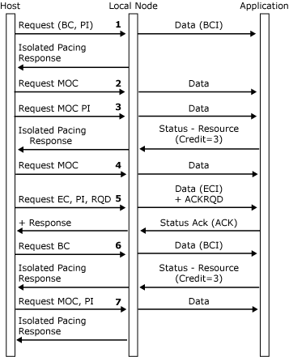

# Outbound Pacing
If the application has enough resources to handle outbound data as fast as the network can provide it (for example, a screen), or if a higher level protocol (for example, immediate request mode) constrains the data flow, the application need not be involved in pacing, and it is possible for the local node to handle outbound pacing transparently.  
  
 However, certain types of applications may require involvement in outbound pacing. If the application has limited resources (for example, a printer), the application should specify the application pacing option in the connection information control block (CICB) on the [Open(PLU) OK Response](./open-plu-oresponse2.md). (For more information, see [Opening the PLU Connection](../core/opening-the-plu-connection1.md).) The application should also provide the local node with information about the state of these resources initially on the **Open(PLU) OK Response** and periodically using **Status-Resource** messages.  
  
 To assist the application in calculating the initial credit field in the **Open(PLU) OK Response**, the local node delivers the pacing window sizes and the primary and secondary maximum request/response unit (RU) sizes on the [Open(PLU) Request](./open-plu-request2.md). The initial credit must be at least as large as the primary to secondary pacing window size. Otherwise, the **BIND** will be rejected and the application will be sent an [Open(PLU) Error Confirm](./open-plu-error-confirm2.md) message. The local node fills in a suggested initial credit value of one more than the pacing window (to try to avoid stop-start situations).  
  
 Note that the local node will also reject the **BIND** if the application specifies that it needs to be involved in pacing (of whatever initial credit), but the **BIND** specifies that there is no outbound pacing.  
  
 Only function management data (FMD) requests are part of the credit scheme, so the application must maintain space within its buffer for one [Status-Control](./status-control1.md) request per RU in addition to the number of RUs specified by the initial credit count. (A **Status-Control** message takes up 36 bytes.)  
  
 Each unit of credit that the application delivers to the local node allows the local node to give the application a single RU (or a single chunk if chunking is being used). Note that if the application is receiving segments, this may correspond to several **DATAFMI** messages. The application can count RUs for the purpose of outbound flow control by using the begin basic information unit (BBIU) and end basic information unit (EBIU) flags.  
  
 The application should maintain a credit-used count, which it should report to the local node on [Status-Resource](./status-resource1.md) messages. The application needs to take the following actions:  
  
- On processing (not receiving) **DATAFMI** messages with EBIU set (corresponding to FMD requests), increment the credit-used count by one.  
  
- On processing **Status-Control** messages and all other messages from the local node, do not increment the credit-used count.  
  
- Periodically report the current credit-used count on a **Status-Resource** message.  
  
- Report the credit-used count when its buffer becomes empty (whatever the last message processed was), unless the credit-used count is zero.  
  
- When the credit-used count is reported to the local node, reset it to zero.  
  
  The frequency at which the application provides [Status-Resource](./status-resource1.md) messages is not architected. However, the local node will only send the application as many [Data](./data1.md) messages as it has received credit for. When the application's credit-used count reaches the initial credit value, the local node will not send any more data. The application should attempt to send a **Status-Resource** message before this happens, because if the local node cannot send a **Data** message to the application and the host is still sending requests, the local node may not be able to send a pacing response to the host when required, with a consequent degradation of performance.  
  
  If the pacing window is small, such as one or two, the application should send a **Status-Resource** after processing each **DATAFMI** message to enable the local node to send the suitable pacing response.  
  
  The following figure shows the local node handling outbound pacing when the application is not involved (APPLPAC = 0x00). The pacing window is assumed to be two.  
  
    
  Local node handling outbound pacing  
  
  The following figure shows the local node and the application handling outbound pacing with the outbound pacing window assumed to be two and the initial credit from the local node to the application assumed to be four. Note that the local node can send an isolated pacing response (IPR) to the host to get another window full of data as soon as the application has sufficient credit for the rest of the present window and the next window.  
  
    
  Local node and application handling outbound pacing  
  
## See Also  
 [Opening the PLU Connection](../core/opening-the-plu-connection1.md)   
 [PLU Session](../core/plu-session2.md)   
 [Outbound Chaining](../core/outbound-chaining2.md)   
 [Inbound Chaining](../core/inbound-chaining1.md)   
 [Segment Delivery](../core/segment-delivery1.md)   
 [Brackets](../core/brackets1.md)   
 [Direction](../core/direction1.md)   
 [Pacing and Chunking](../core/pacing-and-chunking1.md)   
 [Confirmation and Rejection of Data\]](../core/confirmation-and-rejection-of-data]1.md)   
 [Shutdown and Quiesce](../core/shutdown-and-quiesce1.md)   
 [Recovery](../core/recovery1.md)   
 [Application-Initiated Termination](../core/application-initiated-termination1.md)   
 [LUSTATs\]](../core/lustats]1.md)   
 [Response Time Monitor Data](../core/response-time-monitor-data1.md)