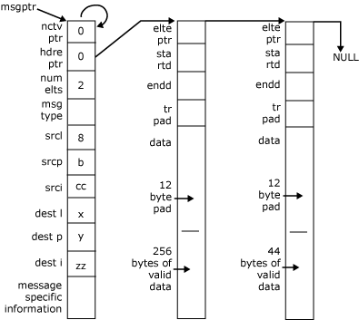

# Overview of Message Formats
A message always contains fixed-format header information such as a message type and addressing information. It can also contain other header information specific to a particular message type (such as the message subtype) and an indefinite amount of extra data.  
  
 Messages are saved in buffers that consist of one header and zero or more elements:  
  
- The header contains the fixed-format information and a pointer to an element. (This pointer is NULL if there are no elements associated with the message.)  
  
- An element contains any extra data for a message and a pointer to another element if the data continues into another element.  
  
  Buffer headers and elements are regarded as contiguous (8-bit) byte sequences. Messages of any length can be built by chaining sufficient elements to a header.  
  
  The following figure shows a typical message with two elements.  
  
    
  Typical message with two elements