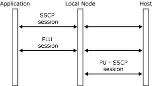

# Overview of SNALink
A [!INCLUDE[hishostintegrationserver2009](../core/includes/hishostintegrationserver2009-md.md)] SNALink must implement an SNA-compatible data transport mechanism capable of connecting the local type 2.1 node to remote host (PU4/5) or peer (PU2.1) systems.  
  
 The local node provides the SNA layers of path control, transmission control, data flow control, and logical unit (LU) services. The following figure shows an example of a [!INCLUDE[hishostintegrationserver2009](../core/includes/hishostintegrationserver2009-md.md)] system.  

Sending and receiving messages:   
   

  
 The local node uses the data link control (DLC) interface to communicate with a SNALink. This interface is defined in [The Data Link Control Interface](../core/data-link-control-interface.md). The SNALink and the DLC driver are responsible for transferring data between the path control layer of the node and the DLC adapter.  
  
 The routing of messages that flow between Host Integration Server components is handled by the SnaBase and Dynamic Access Module (DMOD) components. For details about how to send and receive messages, see [The SNALink Interface](../core/snalink-interface.md).