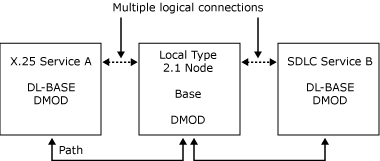

# Paths and DMODs (SNADIS)
Dynamic Access Modules (DMODs) are responsible for the communication between localities. When the DMODs in two localities can successfully pass messages between them, a path is said to exist between the two localities. A path must exist between two localities before a connection can exist between partners in those localities.  
  
 In Host Integration Server a path is implemented using reliable LAN connections (named pipes and TCP/IP) with one LAN connection for each path. When the two localities are on the same computer, a local pipe is used. This is implemented using shared buffers to increase performance. It is used by the application in exactly the same way as communication with a remote locality.  
  
 The DMOD provides communication between dynamic localities and provides guaranteed in-order delivery of messages flowing over paths between localities. If the DMOD loses its path to another locality, it informs the Base.  
  
 The following figure illustrates the paths and connections between a Host Integration Server local node and two SNALinks. X.25 service A has two connections to the local node (one for each of two virtual circuits); SDLC service B has one connection to the local node.  
  
   
Paths and connections between a Host Integration Server local node and two SNALinks
