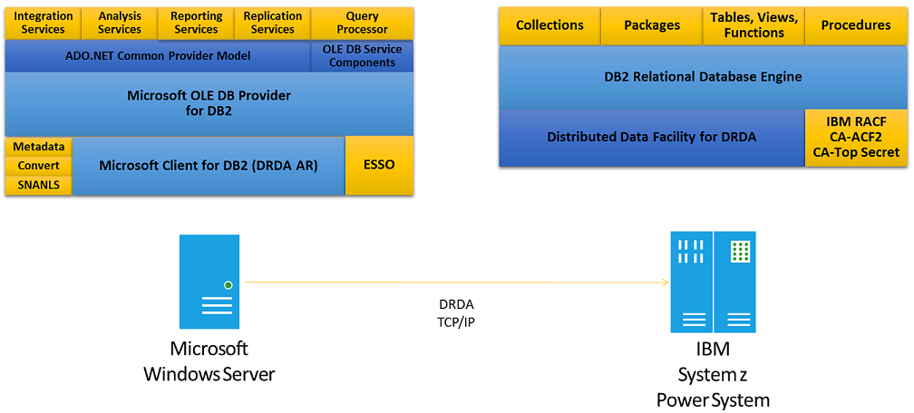
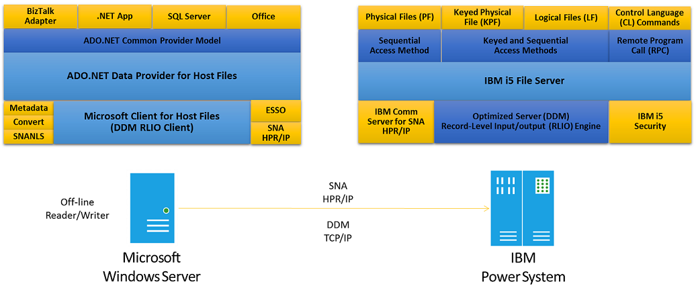
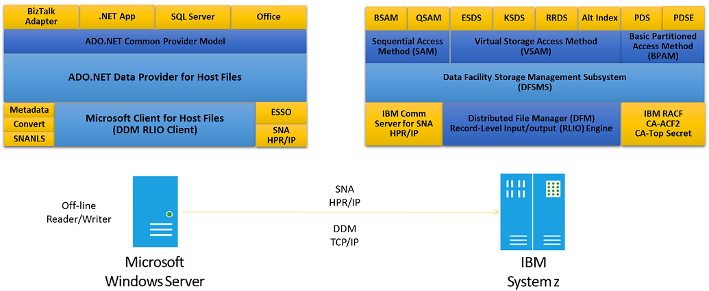
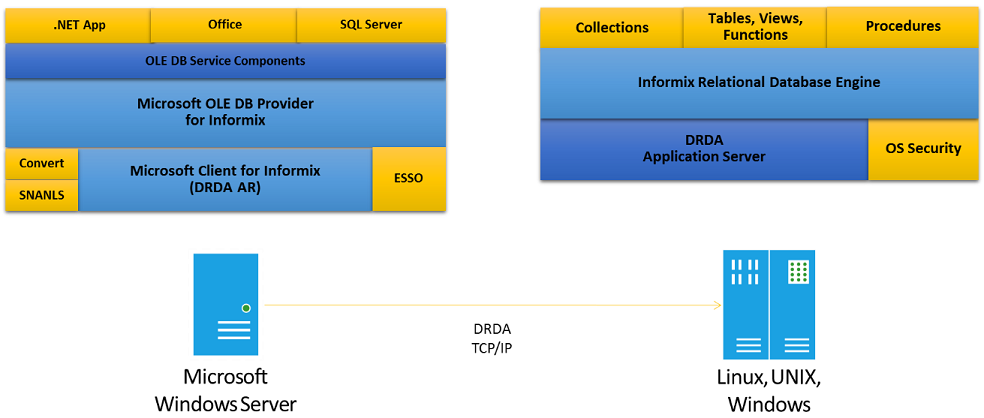

# Planning and Architecting Solutions Using Data Clients
## Data Clients
 Microsoft data clients enable enterprise developers to deliver new applications faster with less custom coding through improved productivity using Microsoft Visual Studio and Microsoft .NET Framework, without requiring knowledge of host systems and infrastructure, compared to IBM host development tools and technologies. Microsoft data clients empower knowledge workers and decision-makers to analyze and report vital information faster, by directly accessing host data sources from tools within Microsoft Fabric and SQL Server, without needing to schedule host developers to write programs to extract and convert host data structures.

 

 Host Integration Server data clients connect new solutions based on Microsoft Windows operating systems with existing information stored in IBM DB2 and Informix database, IBM mainframe and midrange host file systems.

## Data Sources
 The following table describes the supported platforms and versions.

|Data Source|Platform and Version|
|-|-|
|DB2|IBM DB2 for z/OS, 12 and 11   IBM DB2 for IBM i 7.4, 7.3 and 7.2   IBM DB2 UDB for Windows, AIX, HP-UX, Solaris, Linux 11.5, 11 and 10.5|
|Informix|IBM Informix IDS 12.1 and 11.7|
|Host Files|IBM DFSMS DFM z/OS 2.3 and 2.2   IBM i 7.4, 7.3 and 7.2|

 The Host Integration Server data client integration technologies and tools use IBM and industry-standard protocols and formats to help you connect to the back end data sources. The common IBM architecture is Distributed Data Management (DDM), which IBM has built into DB2 and Informix servers, mainframe z/OS and midrange IBM i file systems.

## Clients
 When accessing remote IBM DB2 and Informix database servers, Microsoft technologies operate as industry-standard Distributed Relational Database Architecture (DRDA) Application Requester (AR) clients. To connect to IBM file systems (Host Files), Microsoft technologies operate as IBM-standard Distributed Data Management (DDM) Record-Level Input/Output (RLIO) clients.

|Data Source|Protocol Client|
|-----------------|---------------------|
|DB2|Microsoft Client for DRDA (msdrda.dll)|
|Informix|Microsoft Client for DRDA (msixdrda.dll)|
|Host Files|Microsoft DDM Client (included in MsHostFileClient provider)|

## Providers
 On top of these network clients, Host Integration Server offers a set of data provider features for you to use. The following table describes providers, architecture and consumers.

|Provider|Architecture|Consumers|
|--------------|------------------|---------------|
|ADO.NET Provider for DB2|ADO.NET|Win Forms, Web Forms, Web Services, SQL Server Integration Services|
|BizTalk Adapter for DB2|BizTalk Messaging|BizTalk Server|
|OLE DB Provider for DB2|COM OLE DB|Office Excel, SharePoint, SQL Server (Integration Services, Analysis Services, Reporting Services, Replication Services, and Query Processor), SQL Server PowerPivot for Excel, SQL Server PowerPivot for SharePoint|
|ODBC Driver for DB2|Open Database Connectivity|ODBC consumers and custom ODBC applications|
|OLE DB Provider for Informix|COM OLE DB|OLE DB consumers and ADO.NET Provider for OLE DB applications|
|ADO.NET Provider for Host Files|ADO.NET|Win Forms, Web Forms, Web Services, SQL Server Integration Services|
|BizTalk Adapter for Host Files|BizTalk Messaging|BizTalk Server|

## Tools
 When you want to define and manage connections, configure or develop applications, Microsoft offers the set of technologies described in the following table.

|Product|Tool|Data Source|Description|
|-|-|-|-|
|HIS|Data Access Tool with Data Source Wizard|Informix Host, files|HIS Data Access Tool with Data Source Wizard guides the knowledge worker, IT professional or enterprise developer to define and manage connections to DB2, Informix and host files.|
|HIS|Data Access Library|DB2, Informix, Host Files|HIS Data Access Library offers a set of .NET Framework 4 components to automate common data administration tasks, such as defining connections and creating static SQL packages for DB2.|
|HIS|VS Designer plug-in|Host Files|The HIS client for host files relies on an HIS Host Files Designer for Visual Studio plug-in, allowing enterprise developers to import COBOL and RGP with which to define local metadata maps that are required for encoding/decoding record layouts.|
|Visual Studio|VS Server Explorer, Query and View Designer, DataSet Designer with TableAdapter Wizard|DB2|VS Server Explorer, Query and View Designer, DataSet Designer with TableAdapter Wizard assist the enterprise developer to develop Windows Form, XML Web Service and Web Form applications with less ADO.NET provider coding required.|
|SharePoint|Data Sources in SharePoint Designer|DB2|SharePoint Designer enables IT professionals to integrate host data with collaboration and business intelligence Web sites|
|SQL Server|SQL Server Management Studio and Business Intelligence Development Studio|DB2, Informix|SQL Server Management Studio and Business Intelligence Development Studio enable the IT professional and enterprise developer to deliver data.|
|Excel and SharePoint|SQL Server PowerPivot Add-in for Excel and SQL Server Reporting Services Report Builder|DB2, Informix|SQL Server PowerPivot Add-in for Excel and SQL Server Reporting Services Report Builder enable self-serve business intelligence for streamlining the integration of data from multiple sources.|
|BizTalk Server|BizTalk Administrator and BizTalk Explorer|DB2, Host Files|BizTalk Adapters are based on the Microsoft ADO.NET Data Providers for DB2 and Host Files, offering intuitive wizards to configure the static solicit and response send ports solutions that efficiently integrate DB2 databases without writing code.|

## Data Access Library
 The Data Access Library (DAL) offers .NET Framework 4 components and interfaces to automate common administrative tasks, such as defining connections, changing passwords, creating standard and customer packages.

-   Creating Connections for DB2.

-   Creating Connections for Host Files.

-   Creating Standard Packages for DB2.

-   Creating Custom Packages for DB2.

-   Changing Passwords for DB2.

## Data Access Tool
 Additionally, the Host Integration Server Data Access Tool and Data Source Wizard utilize the Data Access Library as underlying technology, to connect these tools to the Microsoft network clients and data providers at runtime. For example, when using the Data Source Wizard to test a connection, the Data Source Wizard connects via the Data Access Library to the Microsoft network client for DB2.

 For more information, see Using the Data Access Library in Data Integration (Configuration) and the Microsoft.HostIntegration.DataAccessLibrary Namespace documentation.

## SQL Server
 SQL Server provides a rich array of tools that you can use to create DB2 solutions with SQL Server consumers.

### SQL Server Management Studio
 SQL Server Management Studio is an integrated environment that you can use for accessing, configuring, managing, administering, and developing all components of SQL Server. You can use the graphical tools and script editors in SQL Server Management Studio to work with DB2 data and SQL Server data. In addition, SQL Server Management Studio works with all components of SQL Server such as Reporting Services and Integration Services. For more information, see [Using SQL Server Management Studio](/sql/ssms/download-sql-server-management-studio-ssms).

 

 HIS data client for DB2 supports an OLE DB Provider for DB2 that can be consumed by all SQL Server technologies.

### Integration Services
 You can use Integration Services to create data extraction, transformation, and loading (ETL) applications. It contains templates for packages, data sources, and data source views, and provides the tools for working with these objects. For more information, see [Integration Services](/sql/integration-services/install-windows/install-integration-services).

### Analysis Services
 You can use Analysis Services for decision support and business analytics. It provides enterprise-grade semantic data models for business reports and client applications such as Power BI, Excel, Reporting Services reports, and other data visualization tools. For more information, see [Analysis Services](/analysis-services/ssas-overview).

### Reporting Services
 You can use SQL Server Reporting Services (SSRS) set of on-premises tools and services to create, deploy, and manage paginated reports that access DB2 data. For more information, see [SQL Server Reporting Services](/sql/reporting-services/create-deploy-and-manage-mobile-and-paginated-reports).

### Replication
 Administrators can move data from SQL Server to DB2 by using the Replication capabilities of SQL Server. For the SQL Server Replication documentation, see [SQL Server Replication](/sql/relational-databases/replication/sql-server-replication).

### Query Processor
 Administrators and developers can use distributed queries to access data from multiple heterogeneous data sources including DB2. For more information about how to configure DB2 data sources, see Connectivity and Data Access. For more information about SQL Server distributed queries, see [Distributed Queries](/host-integration-server/core/query-processor2).

## Host File Access Methods
 Microsoft data providers for host files support multiple access methods, data set types, and record types, depending on the back end data source platform.

|Platform|Access Method|Data Set Type|
|-|-|-|
|Mainframe (z/OS)|Sequential Access Method (SAM)|Basic Sequential Access Method (BSAM) data sets|
|||Queued Sequential Access Method (QSAM) data sets|
||Virtual Storage Access Method (VSAM)|Entry-Sequenced Data Sets (ESDSs)|
|||Key-Sequenced Data Sets (KSDSs)|
|||Fixed-length Relative Record Data Sets (RRDSs)|
|||Variable-length Relative Record Data Sets (VRRDSs)|
|||VSAM Alternate Indexes to ESDSs or KSDSs|
||Basic Partitioned Access Method|Partitioned Data Sets (PDS) and Partitioned Data Set Extended (PDSE) directories and members|
|Midrange (IBM i)|Sequential and Keyed Access|Single and multiple member Physical files (PF) and Keyed physical files (KPF)|
|||Logical files (LF) over a PF or KPF|

 

 HIS data client for host files can access midrange files and submit a remote command.

## Command Syntax
 Host Integration Server data providers support a set of access methods and command syntax, depending on the data source and provider architecture. The following table describes the supported providers, command types and command syntax.

|Provider|Command Types|Command Syntax|
|--------------|-------------------|--------------------|
|ADO.NET Provider for DB2|Dynamic SQL, Static SQL, Stored Procedures|ANSI SQL 92 Entry-level syntax supported by IBM DB2 servers|
|BizTalk Adapter for DB2|Dynamic SQL, Stored Procedures|Subset of ANSI SQL 92 Entry-level syntax, specific to HIS data provider (SELECT, INSERT, UPDATE, DELETE, CALL)|
|OLE DB Provider for DB2|Dynamic SQL, Static SQL, Stored Procedures|ANSI SQL 92 Entry-level syntax supported by IBM DB2 servers|
|ODBC Driver for DB2|Dynamic SQL, Static SQL, Stored Procedures|ANSI SQL 92 Entry-level syntax supported by IBM DB2 servers|
|OLE DB Provider for Informix|Dynamic SQL, Stored Procedures|ANSI SQL 92 Entry-level syntax supported by IBM Informix servers|
|ADO.NET Provider for Host Files|Sequential, Keyed, Relative Record|Subset of ANSI SQL 92 Entry-level syntax, specific to HIS data provider (SELECT, INSERT, UPDATE, DELETE)|
|BizTalk Adapter for Host Files|Sequential, Keyed, Relative Record|Subset of ANSI SQL 92 Entry-level syntax, specific to HIS data provider (SELECT, INSERT, UPDATE, DELETE)|

## Programming Models
 Host Integration Server data integration technologies allow you to develop custom applications using Microsoft data access architectures and development tools. The following table lists the data sources, providers, architectures and tools available for custom application development.

|Data Source|Data Provider|Data Provider Namespace or Program Name|Data Access Architecture|Programming Languages|
|-----------------|-------------------|---------------------------------------------|------------------------------|---------------------------|
|DB2|Microsoft ADO.NET Data Provider for DB2|Microsoft.HostIntegration.MsDb2Client|ADO.NET|Microsoft Visual Basic.NET, Microsoft C#, Microsoft Visual C++|
|DB2|Microsoft OLE DB Provider for DB2|DB2OLEDB|OLE DBADO.NET|Microsoft Visual Basic.NET, Microsoft C#, Microsoft Visual C++|
|DB2|ODBC Driver for DB2|MSEIDB2D|ODBCOLE DBADO.NET|Microsoft Visual Basic.NET, Microsoft C#, Microsoft Visual C++|
|Informix|Microsoft OLE DB Provider for Informix|MSINFORMIX|OLE DBADO.NET|Microsoft Visual Basic.NET, Microsoft C#, Microsoft Visual C++|
|Host Files|Microsoft ADO.NET Data Provider for Host Files|Microsoft.HostIntegration.MsHostFileClient|ADO.NET|Microsoft Visual Basic.NET, Microsoft C#, Microsoft Visual C++|

 

 HIS data client for host files can access mainframe sequential, VSAM and partitioned data sets.

 You should use ADO.NET and the .NET Framework to develop all new custom applications to integrate important information stored in IBM DB2 databases and host file systems.

 

 HIS data client for Informix supports an OLE DB Provider for Informix that can be consumed from ADO.NET.
