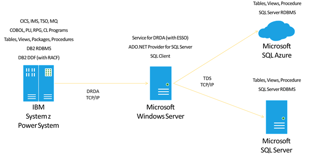
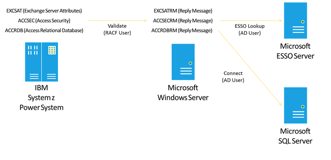
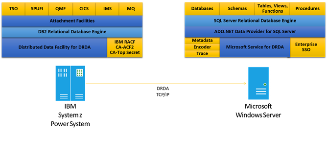
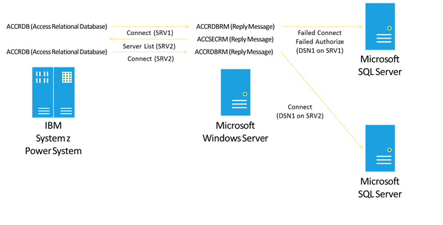

# Planning and Architecting Solutions Using Microsoft Service for DRDA
The following sections provide help for planning and architecting solutions using Microsoft Service for DRDA (DRDA Service).  
  
## Planning  
 Enterprise IT organizations need to deliver new solutions, while increasing developer efficiency and reducing costs. The DRDA Service offers technology and tools to enable IT professionals and enterprise developers to deploy new solutions based on Microsoft SQL Server, while connecting existing workloads based on IBM DB2. The following diagram provides a high-level architecture of the technologies and components involved in a DRDA Service solution that connects IBM DB2 clients to Microsoft SQL Server databases.  
  
   
  
 The previous illustration shows the plan for connecting IBM CICS for z/OS client programs, through DB2 for z/OS and the Service for DRDA, to remote Microsoft SQL Server databases.  
  
 The Microsoft Service for DRDA (Distributed Relational Database Architecture) is an Application Server (AS) that enables DRDA Application Requester (AR) clients, such as IBM DB2 for z/OS and DB2 for i5/OS, to execute static SQL statements mapped to SQL Server stored procedures. The DRDA Service provides host-initiated data integration essential to enterprises during a phased workload migration, or for daily operations in support of remote batch or business intelligence solutions.  
  
 The DRDA Service offers the following features.  
  
-   Access from DRDA clients to SQL Server across a TCP/IP network connection.  
  
-   Security authentication and data encryption.  
  
-   Distributed two-phase commit transactions.  
  
-   Static SQL statements mapped to SQL Server stored procedure calls.  
  
-   Limited dynamic data manipulation language commands mapped to T-SQL commands.  
  
-   Data type mapping and conversion, string encoding, and datetime formatting.  
  
-   Error code and text mapping to DRDA reply messages and formatted error objects.  
  
-   A trace utility for recording flows and commands to enable troubleshooting of problems.  
  
### Distributed Relational Database Architecture  
 IBM DB2 clients and servers communicate using Distributed Relational Database Architecture (DRDA) protocol and formats. The DRDA Service functions as a DRDA Application Server (AS) to enable DRDA Application Requester (AR) clients to interact with Microsoft SQL Server databases. The DRDA Service supports a limited set of DRDA code points as defined in the architecture references published by The Open Group ([http://www.opengroup.org](http://www.opengroup.org)).  
  
- DRDA, Version 5, Volume 1: Distributed Relational Database Architecture (DRDA)  
  
- DRDA, Version 5, Volume 2: Formatted Data Object Content Architecture (FD:OCA)  
  
- DRDA, Version 5, Volume 3: Distributed Data Management (DDM) Architecture  
  
  You can download DRDA V5 Vol. 3: Distributed Data Management Architecture, publication number C114, from the Open Group bookstore ([http://go.microsoft.com/fwlink/?LinkID=219127&clcid=0x409](http://go.microsoft.com/fwlink/?LinkID=219127&clcid=0x409)).  
  
### IBM DB2 Servers and Clients  
 Microsoft, IBM, and third-party vendors implement DRDA protocols and formats in various DRDA Application Requester (AR) client technologies. The DRDA Service supports in-bound connections from DRDA AR clients that conform to the DRDA Version 5 standard, including DRDA ARs packaged in these IBM and Microsoft products.  
  
- IBM DB2 for z/OS V9 and V10  
  
- IBM DB2 for i5/OS V5R4, V6R1, V7R1  
  
- IBM DB2 for LUW V9.7 and V10  
  
  Microsoft HIS 2013 includes two DRDA Application Requester clients, one designed to connect to remote IBM DB2 database servers and one designed to connect to remove IBM Informix database servers. These DRDA ARs support a subset of DRDA Version 5.0. The Microsoft client for DB2 supports these data providers for DB2:  
  
- Microsoft ODBC Driver for DB2  
  
- Microsoft OLE DB Provider for DB2  
  
- Microsoft ADO.NET Framework Data Provider for DB2  
  
- Microsoft BizTalk Adapter for DB2  
  
- Microsoft Entity Framework Provider for DB2  
  
  The Service for DRDA provides basic DRDA support for Microsoft DRDA clients and IBM DRDA clients.  
  
### Enterprise Single Sign-On  
 The DRDA Service relies on Microsoft Enterprise Single Sign-On to map in-bound host credentials (e.g. RACF user authorization identifier) to out-bound Windows Active Directory (AD) credentials, allowing the DRDA Service to connect to SQL Server using Integrated Security.  
  
   
  
 The previous illustration shows how with Enterprise Single Sign-One enabled the DRDA Service is able to map inbound DRDA credentials to outbound SQL Server credentials.  
  
 Host-initiated ESSO requires elevated permissions in Active Directory (Kerberos constrained delegation, and Use any authentication protocol). ESSO requires a Kerberos Service Principal Name for the SQL Server computer to which the DRDA Service connects. .  
  
### Microsoft SQL Server  
 Enterprise administrators and developers rely on Microsoft SQL Server to build mission critical data platforms for line-of-business applications. SQL Server helps enterprises to unlock new insights through data discovery across the organization while providing tools consistent data and large scale analytics and data warehousing. The DRDA Service can connect existing IBM host workloads to new solutions based on Microsoft SQL Server to enable heterogeneous enterprise applications and business intelligence.  
  
 The DRDA Service relies on the Microsoft SQL Server network client and ADO.NET Framework Data Provider for SQL Server for connectivity and data access to SQL Server databases. For more information on Microsoft SQL Server, see [http://www.microsoft.com/sql](http://www.microsoft.com/sql).  
  
## Architecture  
 The DRDA Service enables connectivity from a remote IBM DB2 client program and a local Microsoft SQL Server database, by providing compatibility services based on the industry-standard DRDA (Distributed Relational Database Architecture) that defines DB2 client-to-server communications in the form of a set of protocol code points and formats. The DRDA Service operates within the DRDA as an Application Server (AS). The IBM DB2 client programs (e.g. COBOL TOS and CICS for z/OS) are locally-attached to DB2 for z/OS and functions within the DRDA as Application Requester (AS) clients. The DRDA Service is a Windows service program that hosts an instance of the Microsoft .NET Framework, connects to a local or remote Microsoft SQL Server using the Microsoft ADO.NET Framework Data Provider for SQL Server and underlying Microsoft SQL Server network client.  
  
   
  
 The previous illustration shows a DRDA Service solution that connects IBM DB2 for z/OS to Microsoft SQL Server.  
  
### Connectivity  
  
#### Distributed Relational Database Architecture  
 The DRDA Service converts DRDA code points and data formats into corresponding Microsoft ADO.NET connections, transactions, commands, data types, and error objects. The primary function of the DRDA Service is to functionally map static SQL for DB2 packages and statement execution to Microsoft SQL Server stored procedure and CALL statements. The DRDA Service processes the DRDA protocol flows as defined within the architecture based on the various DRDA managers.  
  
#### Network transports and transactions  
 The DRDA Service supports in-bound authenticated DRDA client connections across a TCP/IP network. The DRDA Service does not support SNA APPC over LU6.2 using HPR/IP (High Performance Routing over Internet Protocol). To connect to SQL Server, the DRDA Service uses an underlying Microsoft ADO.NET Provider for SQL Server and SQL network client, supporting in-memory, named pipes, and TCP/IP network connections.  
  
 By default, the DRDA Service will listen on the default DRDA port 446 for in-bound connections, accepting any DRDA client connection request. Optionally, the DRDA Service can listen on another pre-configured port number. Also, to improve security, the DRDA Service can be configured to accept in-bound connection requests from a pre-defined list of remote network addresses.  
  
 To enable reliable updates across the network, the DRDA Service supports DRDA DUW (Distributed Unit of Work) two-phase commit transactions. The DRDA DUW transactions are mapped to SQL Server transactions through the Microsoft ADO.NET Framework Data Provider for SQL Server and underlying SQL network client.  
  
#### Pooling and failover  
 The DRDA Service supports the SQL client connection pooling through configuring the SQL client pooling options in the SQL Server connection string arguments in the DRDA Service app config. Also, the DRDA Service offers an internal connection pool, mapping in-bound DRDA AR client connections and authentication credentials to out-bound SQL Server database connections and credentials.  
  
   
  
 DRDA Service primary and partner server work together for fault tolerant failover.  
  
 The DRDA Service can operate in groups of two (2) servers, one per computer, to provide basic fault tolerance. When a DRDA AR client connects to a SQL Server database, the DRDA Service returns a DRDA SRVLST (Server List) with a weighted list of Data Server instances. In case of failover of a primary DRDA Service, the DRDA AR can use this information to connect to the alternate member of a pair of DRDA Service computers. Combined with SQL Server clustering or mirroring, this technology can offer a reasonable level of fault tolerant failover protection.  
  
#### Authentication and encryption  
 To secure information, the DRDA Service supports common DRDA authentication and data encryption technologies. For example, the DRDA Service can support basic authentication (plain text EBCDIC-encoded username with password) or secure authentication using 256-bit Advanced Encryption Standard (AES). Also, the DRDA Service can support combined authentication and encryption using Secure Sockets Layer (SSL) V3.0 or Transport Layer Security (TLS) V1.0.  
  
 To provide integrated authentication, the DRDA Service can combine in-bound credential validation and mapping using Microsoft Enterprise Single Sign-On (ESSO), with out-bound SQL Server authentication using Windows SSPI (Security Support Provider Interface). For example, the DRDA Service can work with ESSO to map an IBM RACF (Resource Access Control Facility) username and password to a Microsoft Windows Active Directory domain\username, with which to connect with integrated security to a remote SQL Server database.  
  
### Compatibility  
  
#### Static and Dynamic SQL  
 Primarily, the DRDA Service enables DB2 client programs to execute remotely-defined static SQL for DB2 packages, by mapping the package statements to SQL Server stored procedures. For example, when a DB2 administrator or programmer bind copies a DB2 package to SQL Server, the DRDA Service converts the DRDA BNDSQLSTT (Bind SQL Statement) flows into SQL Server T-SQL CREATE PROCEDURE statements. When the DB2 program executes the remote package statement, the DRDA Service converts the DRDA OPNQRY (Open Query) or EXCSQLSTT (Execute SQL Statement) into a CALL statement.  
  
 Secondarily, the DRDA Service supports limited dynamic SQL operations to allow DB2 client programs to execute remote SQL Server T-SQL commands. For example, a DB2 administrator can utilize QMF (Query Management Facility) for z/OS to query a remote SQL Server table.  
  
#### SQL Syntax  
 The DRDA Service has a limited DB2 ANSI to SQL Server T-SQL command syntax transformer that it utilizes for binding packages, executing static and dynamic SQL statements. Optionally, the DRDA Service offers additional compatible DB2 functions in the form of SQL Server CLR-based functions.  
  
 The DRDA Service offers a replaceable package bind component for processing DRDA BNDSQLSTT (Bind SQL Statement) to SQL Server T-SQL CREATE PROCEDURE statements. For example, an ISV (Independent Software Vendor) or enterprise developer can implement a custom-defined package binding component to support syntax, data type, encoding, or other required conversions.  
  
#### Catalog and schema names  
 The DRDA Service offers basic mapping of high-level object identifiers, including catalog and schema names. For example, the DRDA Service can map an in-bound DRDA RDBNAM (Relational Database Name) to an out-bound SQL Server database name. Also, the DRDA Service can map an in-bound DRDA COLLID (Collection Identifier) to an outbound SQL Server schema name.  
  
#### Data type conversion  
 To support cross platform interoperability between SQL Server databases running on Windows operating systems and DB2 servers running on z/OS and i5/OS, the DRDA Service offers a set of data type mappings and conversions defined in XML files (DB2ToMSSql.xml and MSSQLToDB2.xml). For example, the DRDA Service can maps and will convert in-bound DB2 DECIMAL to out-bound SQL Server money.  
  
#### String encodings  
 The DRDA Service supports converting from DB2 EBCDIC string encodings to SQL Server ANSI and UNICODE encodings. Optionally, the DRDA Service supports modified replaceable Windows EBCDIC-to-UNICODE NLS (National Language Support) conversion files. Also, the DRDA Service offers in-line character replacement based on a pre-defined map using CCSID (Coded Character Set Identifier) hexadecimal value pairs.  
  
#### Datetime formatting  
 The DRDA Service offers in-line DB2 DATE/TIME/TIMESTAMP to SQL Server date/time/datetime2 format and string literal value conversions. For example, the DRDA Service can convert an in-bound DB2 formatted TIMESTAMP string literal value in the form YYYY-MM-DD-hh.mm.ss.tttttt to an out-bound SQL Server datetime2(6) value in the form YYYY-MM-DD hh:mm:ss.tttttt.  
  
### Administration  
 An administrator can configure the DRDA Service by modifying the MsDrdaService.exe.config file, along with ancillary XML files (data types and error mapping), prior to starting the DRDA Service. Optionally, the DRDA Service offers immediate reading of the MsDrdaService.exe.config to enable dynamic configuration updates.  
  
#### Configuration  
 Post-installation, IT professionals can customize the DRDA Service configuration by editing the MsDrdaService.exe.config file and updating other XML files. The following is a listing of DRDA Service components, configurable items, and configuration stores.  
  
||||  
|-|-|-|  
|Component|Items|Configuration Store|  
|DRDA Service|Service Credentials   Security Policy Rights   Connection Manager   Security Manager   SQL Access Manager   Database Manager|Windows Registry   MsDrdaService.exe.config   MSDRDAErrorMappings.xml|  
|Data Conversion|Data Type Mappings   Date, Time, DateTime Formats|DB2ToMSSql.xml MSSQLToDB2.xml   MsDrdaService.exe.config|  
|Code Page Conversion|Custom Code Pages   Code Point Mappings|Windows Registry   MsDrdaService.exe.config|  
|Bind Listeners|Default Listener   Custom Listener|MsDrdaService.exe.config|  
|Trace Listeners|Text Listener   Console Listener   ETW Listener   Custom Listener|MsDrdaService.exe.config|  
|Event Log|Events|Application Log|  
|Performance Monitor|Counters|Windows Registry   MsDrdaService.exe.config|  
  
 The previous table lists the configurable DRDA Service components, items, and configuration stores.  
  
#### Tracing  
 The DRDA Service supports multiple trace options console listener tracing, text listener tracing, event log listener, ETW (Event Tracing for Windows) listener, and custom tracing. The administrator uses the console tracing when running the DRDA Service in Windows console mode, to output trace data to the screen. The administrator uses text tracing when running the DRDA Service in Windows service mode or console mode, to output trace data to a text-readable file. The DRDA Service automatically posts event log listener trace items to the Windows Event Log. The administrator uses ETW tracing for high speed data collection. Optionally, the enterprise developer can implement a custom trace listener to output all or selected trace data to another component.  
  
#### Accounting and logging  
 The DRDA Service supports the standard DRDA accounting code points: Client Workstation Name; Client User ID; Client Application Name; and Client Accounting. An enterprise developer can specify dynamic values in their program with which to populate the DRDA client accounting properties. The DRDA Service reads the values at runtime to populate the DRDA Service trace, allowing correlation of problems to specific application and user context. Optionally, the enterprise developer can implement a DRDA Service customer trace listener with which log DRDA AR client requests. For example, a customer trace listener can log selected network and database access, based on a client account value, to a remote SQL Server logging database.  
  
#### Error mapping  
 The DRDA Service returns SQL Server errors in the form of either a DRDA code point Reply Message (RM) or DRDA SQLCARD (SQL Communications Area Reply Data). By default, for common issues, the DRDA Service uses a built-in table to map SQL error codes and error strings to DRDA reply messages and errors. Also, the DRDA Service uses an external MsDrdaErrorMappings.xml file to map from SQL Server error code and error text to SQLCODE, SQLSTATE, Reason Code, and Error Message.