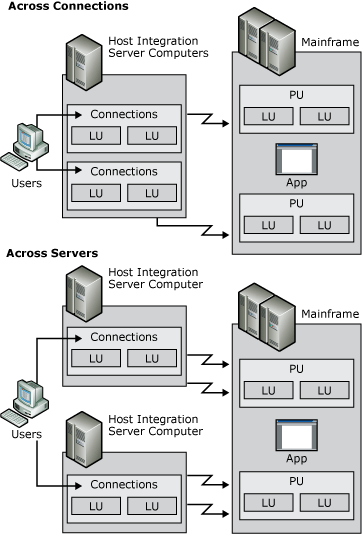

# Providing Hot Backup and Load Balancing (3270)
The following diagram shows hot backup across host connections on the same server and across servers.  
  
   
Diagram showing hot backup across host connections on the same server and across servers  
  
 To recover from situations where a particular host connection has failed, the Host Integration Server hot backup feature can be configured to allow for similarly configured resources to automatically fill in and support functions dependent on the failed connection. When a failure occurs, a user can simply reconnect to a given resource using an alternate connection or server without reconfiguring client software. Hot backup can be implemented across host connections on the same server, or across several servers in a domain using LU pools as shown in the preceding figure. Implementing fault-tolerant connections is a recommended strategy for enterprises of any size, and helps to provide reliable host access to your users.  
  
 Related to hot backup is a feature called load balancing. Load balancing evenly distributes sessions across multiple host connections and multiple servers using 3270 LU pooling. Instead of explicitly requesting specific LUs, users request the first available LU in a pool and Host Integration Server randomly assigns the user a free LU in the pool. Because each LU can be configured using different connections or servers, the server load can be spread out across all configured resources. Load balancing is implemented automatically when a pool is configured with LUs from multiple servers or connections.  
  
## See Also  
 [LU Pools (3270)](../core/lu-pools-3270-1.md)   
 [Assigning LUs to Workstations (3270)](../core/assigning-lus-to-workstations-3270-1.md)   
 [Deployment Strategies (3270)](../core/deployment-strategies-3270-1.md)
