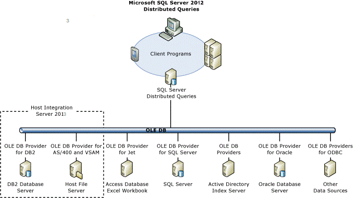

# Query Processor
  
##  <a name="dist"></a> SQL Server Distributed Queries for DB2  
 Distributed Queries in SQL Server provide distributed concurrent access to multiple data sources. The Distributed Query Processor (DQP) allows you to create heterogeneous queries that join tables in SQL Server with tables in DB2, Host File systems, Oracle, or any other data source accessible by an OLE DB provider. You can use DQP to create SQL Server views over DB2 tables so that developers can write directly to SQL Server and integrate both Windows-based and host-based data in their applications.  
  
 The following diagram shows DQP architecture for accessing data with Host Integration Server (HIS).  
  
   
  
 To access data from an OLE DB data source, SQL Server requires the following information:  
  
1. The name of the OLE DB provider  
  
2. Connection information in the form of an OLE DB initialization string  
  
3. The table name or SQL query string  
  
4. Authorization credentials  
  
   You can reference heterogeneous data sources using one of three methods:  
  
5. Ad Hoc Name  
  
6. Linked Server Names  
  
7. Pass-Through Queries  
  
## Ad Hoc Name Queries
  
 An ad hoc name is used for infrequent queries against OLE DB data sources that are not defined as linked servers. In SQL Server, the **OPENROWSET** and **OPENDATASOURCE** functions provide connection information for accessing data from OLE DB data sources. By default, ad hoc names are not supported. The **DisallowAdhocAccess** provider option must be set to 0 and the **Ad Hoc Distributed Queries** advanced configuration option must be enabled.  
  
 The following code fragment displays the syntax for enabling ad hoc name queries.  
  
```  
-- Example of enabling Ad Hoc Name Query   
sp_configure 'show advanced options', 1;  
GO  
  
RECONFIGURE;  
GO  
  
sp_configure 'Ad Hoc Distributed Queries', 1;  
GO  
  
RECONFIGURE;  
GO  
  
```  
  
 The following code fragment displays the syntax for creating ad hoc queries.  
  
```  
-- Example of OPENROWSET Ad Hoc Name Query  
  
SELECT * FROM OPENROWSET (  
'DB2OLEDB',  
'Provider=DB2OLEDB;User ID=HISDEMO;Password=HISDEMO;Initial Catalog=DSN1D037;Network Transport Library=TCPIP;Host CCSID=37;PC Code Page=1252;Network Address=SYS1;Network Port=446;Package Collection=MSPKG;Default Schema=NWIND;Units of Work=RUW;Default Qualifier=NWIND;DBMS Platform=DB2/MVS;Use Early Metadata=False;Defer Prepare=False;DateTime As Char=False;Rowset Cache Size=0;Datetime As Date=False;AutoCommit=True;Authentication=Server;Persist Security Info=True;Cache Authentication=False;Connection Pooling=False;Derive Parameters=False;',   
  
'SELECT * FROM NWIND.AREAS'  
  
);   
  
GO  
  
-- Example of OPENDATASOURCE Ad Hoc Name Query  
  
SELECT *  
FROM OPENDATASOURCE(  
     'DB2OLEDB',  
     'Provider=DB2OLEDB;User ID=PLARSEN;Password=PLARSEN;Initial Catalog=DSN1D037;Network Transport Library=TCP;Host CCSID=37;PC Code Page=1252;Network Address=sys1;Network Port=446;Package Collection=MSPKG;Default Schema=NWIND;Units of Work=RUW;Default Qualifier=NWIND;DBMS Platform=DB2/MVS;Defer Prepare=False;Persist Security Info=True;Connection Pooling=False;Derive Parameters=False'  
     ).[DSN1D037].[NWIND].[AREAS]  
  
```  
  
 OPENROWSET and OPENDATASOURCE should be used only to reference OLE DB data sources that are accessed infrequently. For any data sources that will be accessed more than several times, define a linked server. Neither OPENDATASOURCE nor OPENROWSET provide all the functionality of linked server definitions. For example, OPENROWSET and OPENDATASOURCE are macros and do not support supplying Transact-SQL variables as arguments. Ad hoc name queries do not include security management or the ability to query catalog information. Each time that these functions are called, all connection information, including passwords, must be provided.  
  
## Define a Linked Server
  
 You can create a linked server name that defines a connection to DB2 by using Transact-SQL statements, or through the SQL Server Management Studio user interface.  

#### Transact-SQL  
 The following code fragment demonstrates the Transact-SQL syntax for dropping, creating, and specifying authentication credentials for a linked server name definition.  
  
```  
-- Example of dropping linked server by name   
  
EXEC sp_dropserver  
@server = 'DB2EXAMPLE',  
@droplogins = 'droplogins';   
  
GO  
  
-- Example of adding linked server by name  
  
EXEC sp_addlinkedserver   
  
@server = 'DB2EXAMPLE',   
  
@srvproduct = 'x''HIS',   
  
@provider = 'DB2OLEDB',   
  
@catalog = 'DSN1',   
  
@provstr = ‘Provider=DB2OLEDB;User ID=HISDEMO;Password=HISDEMO;Initial Catalog=DSN1D037;Network Transport Library=TCPIP;Host CCSID=37;PC Code Page=1252;Network Address=SYS1;Network Port=446;Package Collection=MSPKG;Default Schema=NWIND;Units of Work=RUW;Default Qualifier=NWIND;DBMS Platform=DB2/MVS;Use Early Metadata=False;Defer Prepare=False;DateTime As Char=False;Rowset Cache Size=0;Datetime As Date=False;AutoCommit=True;Authentication=Server;Persist Security Info=True;Cache Authentication=False;Connection Pooling=False;Derive Parameters=False;';   
  
GO  
  
-- Example of adding linked server login  
  
EXEC sp_addlinkedsrvlogin   
     @rmtsrvname = 'DB2EXAMPLE',   
     @rmtuser = 'HISDEMO',   
     @rmtpassword = 'HISDEMO';   
  
GO  
  
-- Example of enabling pass-through queries  
  
EXEC sp_serveroption   
    @server =  'DB2EXAMPLE',  
    @optname =  'RPC OUT',  
    @optvalue =  'TRUE' ;   
  
GO  
  
-- Example of listing linked servers and options  
EXEC sp_linkedservers;  
GO  
EXEC sp_helpserver;  
GO  
  
-- Example of listing DB2 tables with restriction on schema name  
-- List DB2 columns with restrictions on table name  
  
EXEC sp_columns_ex  
   @table_server = 'DB2EXAMPLE',  
   @table_catalog = 'DSN1D037',  
   @table_schema = 'NWIND',  
   @table_name = 'ORDERS';   
  
GO  
  
-- Example of listing DB2 columns with restriction on schema and table names  
EXEC sp_columns_ex  
   @table_server = 'DB2EXAMPLE',  
   @table_catalog = 'DSN1D037',  
   @table_schema = 'NWIND',  
   @table_name = 'ORDERS';   
  
GO  
  
-- Example of linked server query (SELECT)   
  
SELECT * FROM DB2EXAMPLE.DSN1D037.NWIND.AREAS  
  
GO  
  
-- Example of linked server query (INSERT)   
  
INSERT INTO DB2EXAMPLE.DSN1D037.NWIND.AREAS VALUES (99999, 'Everywhere', 999)   
  
GO  
  
-- Example of linked server query (SELECT with WHERE clause)   
SELECT * FROM DB2EXAMPLE.DSN1D037.NWIND.AREAS WHERE REGIONID > 104  
GO  
-- Example of linked server query (UPDATE)   
  
UPDATE DB2EXAMPLE.DSN1D037.NWIND.AREAS SET AREADESC = 'Nowhere' WHERE AREAID = 99999  
  
GO  
  
-- Example of linked server query (SELECT with WHERE clause)   
SELECT * FROM DB2EXAMPLE.DSN1D037.NWIND.AREAS WHERE REGIONID > 104  
GO  
-- Example of linked server query (DELETE)   
  
DELETE FROM DB2EXAMPLE.DSN1D037.NWIND.AREAS WHERE AREAID = 99999  
  
GO   
  
-- Example of linked server query (SELECT with WHERE clause)   
SELECT * FROM DB2EXAMPLE.DSN1D037.NWIND.AREAS WHERE REGIONID > 104  
GO  
-- Example of linked server query (in a SQL Server VIEW)   
  
DROP VIEW QP_CustomerOrders  
  
GO  
  
CREATE VIEW QP_CustomerOrders  
AS  
SELECT * FROM DB2EXAMPLE.DSN1D037.NWIND.ORDERS  
  
GO  
  
SELECT * FROM QP_CustomerOrders  
  
GO  
  
-- Create SQL Server Stored Procedure to wrap Linked Server Query (SELECT with parameter)   
  
DROP PROCEDURE QP_SP_SelectAreaByAREAID  
  
GO  
  
CREATE PROCEDURE QP_SP_SelectAreaByAREAID  
    @MyArea integer   
AS   
SELECT * FROM DB2EXAMPLE.DSN1D037.NWIND.AREAS WHERE AREAID = @MyArea  
  
GO  
  
SP_HELP QP_SP_SelectAreaByAREAID  
  
GO  
  
DECLARE @return_value int  
  
EXEC @return_value = [dbo].[QP_SP_SelectAreaByAREAID]  
    @MyArea = 1581  
  
SELECT 'Return Value' = @return_value  
  
GO  
  
-- Four-part linked server query (INSERT with DUW transaction)  
--(Note: Requires updated Provider String (provstr) argument (Units of Work=DUW)   
  
SET XACT_ABORT ON  
BEGIN DISTRIBUTED TRAN  
INSERT INTO DB2EXAMPLE.DSN1D037.NWIND.AREAS VALUES ('99999', 'Everywhere', 999)  
COMMIT TRAN  
SET XACT_ABORT OFF  
  
-- Test table (SELECT)  
SELECT * FROM DB2EXAMPLE.DSN1D037.NWIND.AREAS  
  
-- Four-part linked server query (UPDATE with DUW transaction)  
SET XACT_ABORT ON  
BEGIN DISTRIBUTED TRAN  
UPDATE DB2EXAMPLE.DSN1D037.NWIND.AREAS SET AREADESC = 'Nowhere' WHERE AREAID = 99999  
COMMIT TRAN  
SET XACT_ABORT OFF  
  
-- Test table (SELECT)  
SELECT * FROM DB2EXAMPLE.DSN1D037.NWIND.AREAS  
  
-- Four-part linked server query (DELETE with DUW transaction)  
SET XACT_ABORT ON  
BEGIN DISTRIBUTED TRAN  
DELETE FROM DB2EXAMPLE.DSN1D037.NWIND.AREAS WHERE AREAID = 99999  
COMMIT TRAN  
SET XACT_ABORT OFF  
  
-- Test table (SELECT)  
SELECT * FROM DB2EXAMPLE.DSN1D037.NWIND.AREAS  
  
```  
  
 **Pass Through Queries**  
  
 SQL Server sends pass-through queries as uninterpreted query strings to an OLE DB data source. The query must be in a syntax the OLE DB data source will accept. A Transact-SQL statement uses the results from a pass-through query as though it were a regular table reference. The arguments of **OPENROWSET** and **OPENDATASOURCE** do not support variables. The arguments must be specified as string-literals. If variables must be passed in as arguments, a query string that contains the variables can be constructed dynamically and executed by using the EXECUTE statement.  
  
 The following code fragment displays the syntax creating pass through queries.  
  
```  
-- Example of a pass through query (SELECT with parameters)   
  
DECLARE @AMOUNT DECIMAL(9,2);   
SET @AMOUNT = 99.99;  
EXECUTE ('SELECT * FROM NWIND.ORDERS WHERE AMOUNT = ?', @AMOUNT, 'Select') AT DB2EXAMPLE;   
  
GO  
  
-- Example of pass through query to execute DDL statement (DROP PROCEDURE)   
  
EXECUTE ('DROP PROCEDURE NWIND.CUSTORD', 'Drop') AT DB2EXAMPLE;   
  
GO  
  
-- Example of pass through query to execute DDL statement (CREATE PROCEDURE)   
  
EXECUTE ('CREATE PROCEDURE NWIND.CUSTORD (IN CUSTID INT) RESULT SETS 1 LANGUAGE SQL P1: BEGIN DECLARE CURSOR1 CURSOR WITH RETURN FOR SELECT * FROM NWIND.ORDERS WHERE CUSTID = CUSTORD.CUSTID ORDER BY ORDID ASC; OPEN CURSOR1; END P1', 'CreateProc') AT DB2EXAMPLE;   
  
GO  
  
-- Example of pass through query to execute CALL statement (with parameters)   
  
DECLARE @CUSTID INT;   
SET @CUSTID = 10001;  
EXEC ( 'CALL NWIND.CUSTORD(?)', @CUSTID)  AT DB2EXAMPLE;   
  
GO  
  
```  

#### SQL Server Management Studio
 You can also use SQL Server Management Studio to define SELECT, INSERT, UPDATE and DELETE statements that use four-part named linked server queries. These queries provide a common Transact-SQL syntax that can be used over heterogeneous data sources.  
  
 Follow these steps to define a linked server from the SQL Server Management Studio:  
  
1. In the Object Explorer, expand **Server Objects**, click the **Linked Servers** folder, and then right click on **New Linked Server**.  
  
2. In the **New Linked Server** dialog box, enter a Linked server name such as **DB2EXAMPLE**, and select **Microsoft OLE DB Provider for DB2** from the **Provider** list. Enter **HIS** in the **Product name** field. Paste a valid connection string that you defined using the Data Access Tool and Data Source Wizard into the **Provider string** field. Enter the DB2 catalog into the **Location** field.  
  
3. In the Select a page pane, click **Security** and select **Be made using this security context**. Enter a valid DB2 user name in **Remote login** and a password in **With password**.  
  
4. In the Select a page pane, click **Server Options**, click **RPC Out** and select **True**. Click **OK**.  
  
5. To display objects on the remote server, expand the **Linked Server** folder, expand the Linked Server that you defined, expand **Catalogs**, **Tables** and **Views**.  
  
6. To create a query, right click on a table and select **Script table as**. Choose **SELECT to** and select **New Query Editor Window**.  
  
7. From the Query menu click **Execute (F5)**. You will see the rows of data in the Results pane.  
  
   You can also alter the linked server definition or use it as a template for creating other linked server definitions.  
  
8. In the Object Explorer, right-click the Linked Server that you defined previously. Select **Script Linked Server as**, choose **DROP and CREATE to**, and click **New Query Editor Window**.  
  
9. Edit the Transact-SQL statements and click **Execute (F5)** from the Query menu.  
  
10. Right-click the re-defined or new Linked Server, and then click **Test Connection**.  
  
## See Also  
 [SQL Server](../core/sql-server2.md)