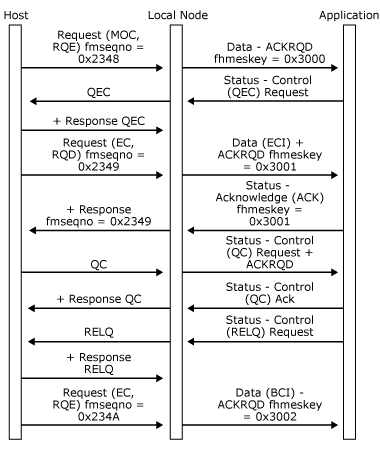
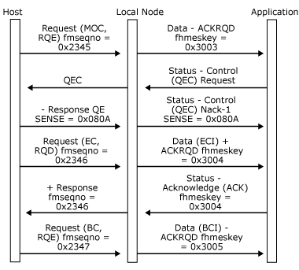
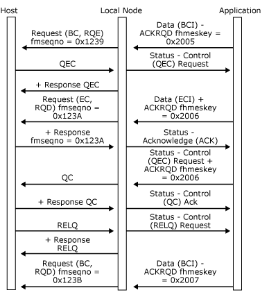

# Quiesce
The quiesce protocol is only supported on sessions using function management (FM) profile 4. The quiesce protocol can be initiated by either half-session.  
  
 When an application wants to quiesce its partner half-session in the host, it sends a **Status-Control(QEC) Request** to the local node. The node generates a **QEC** request to the host, which asks the host to quiesce after completing the current outbound chain.  
  
 If the host quiesces, it sends a **QC** request, which the local node presents to the application as a **Status-Control(QC) Request** (with **ACKRQD**). The host remains in a quiesced state until the application sends a **Status-Control(RELQ) Request**. The local node sends the **RELQ** request to the host, and the host resumes communications on the primary logical unit (PLU) session.  
  
 If the attempt to quiesce the host fails, the host responds with a negative **QEC** response, which the local node presents to the application as a **Status-Control(QEC) Negative-Acknowledge-1**.  
  
 Conversely, a **Status-Control(QEC) Request** (without **ACKRQD**) is presented to the application if a **QEC** request is received from the host. In this direction, **QEC** cannot be rejected. The local node will always force the application to quiesce after presenting it with a **Status-Control(QEC) Request** by rejecting further attempts to send inbound data. When the application has quiesced, it should send a **Status-Control(QC) Request** to the local node, which sends a **QC** request to the host. The application can subsequently be released by an **RELQ** request from the host, which the local node presents to the application as a **Status-Control(RELQ) Request**.  
  
 The receipt of a **CLEAR** or **UNBIND–BIND** sequence, **Close(PLU)–Open(PLU)**, causes the quiesced state to be released.  
  
 The following three figures illustrate the quiesce protocols between the local node and the application and how those protocols relate to the underlying SNA protocols.  
  
 In the first figure, the application quiesces the host and then releases the quiesce.  
  
   
Application quiesces the host and releases the quiesce  
  
 In the following figure, the application attempts to quiesce the host, but the host rejects the quiesce and continues with the next chain.  
  
   
Application attempts to quiesce the host, but the host rejects and continues with the next chain  
  
 In the following figure, the host sends **QEC** while the application is sending a chain. The application completes the chain and sends a **Status-Control(QC) Request**. The host releases the quiesce by sending **RELQ**, and the local node sends a **Status-Control(RELQ) Request** to the application, which then initiates a new chain.  
  
   
Host sends QEC while the application is sending a chain  
  
## See Also  
 [Opening the PLU Connection](../core/opening-the-plu-connection1.md)   
 [PLU Session](../core/plu-session2.md)   
 [Outbound Chaining](../core/outbound-chaining2.md)   
 [Inbound Chaining](../core/inbound-chaining1.md)   
 [Segment Delivery](../core/segment-delivery1.md)   
 [Brackets](../core/brackets1.md)   
 [Direction](../core/direction1.md)   
 [Pacing and Chunking](../core/pacing-and-chunking1.md)   
 [Confirmation and Rejection of Data\]](../core/confirmation-and-rejection-of-data]1.md)   
 [Shutdown and Quiesce](../core/shutdown-and-quiesce1.md)   
 [Recovery](../core/recovery1.md)   
 [Application-Initiated Termination](../core/application-initiated-termination1.md)   
 [LUSTATs\]](../core/lustats]1.md)   
 [Response Time Monitor Data](../core/response-time-monitor-data1.md)
