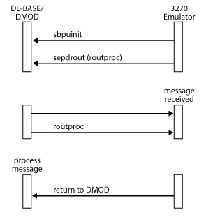

# Receiving Messages
The following figure shows the method for receiving messages from the Dynamic Access Module (DMOD).  
  
   
Receiving messages using a routing procedure  
  
 After DMOD initialization, the 3270 emulator registers the routing procedure by calling [sepdrout](./sepdrout2.md). When the DMOD receives a message, it calls the 3270 emulator routing procedure, which can then process the message.  
  
 With this approach, there is no context switch between the DMOD thread and the 3270 emulator thread. However, the routing procedure must return control to the DMOD quickly. For instance, it cannot suspend waiting for a keyboard input.  
  
 The application must determine whether the received message is for this application or for another application. If the message is not for this application, the routing procedure must return, indicating that the message was not processed. If the application processes the message, it is responsible for freeing the buffer when the processing is finished.  
  
 In some cases, the routing procedure can process the message to completion. An alternative is for the routing procedure to put the message on an application queue and then clear an application semaphore. The application can then subsequently process the message.  
  
 Performance can be improved further by sending a [Status-Resource](./status-resource1.md) message (to return credit to the local node, enabling it to send further data) from the routing procedure when a message is received, rather than waiting until the message is processed to completion. This usage is illustrated in [Sample Code: Initialization and Routing Procedure](../core/sample-code-initialization-and-routing-procedure1.md). For more information about credit and flow control, see [Pacing and Chunking](../core/pacing-and-chunking1.md).  
  
 After the application has received a message, the application is responsible for the buffer in which the message was received. The application must either reuse the buffer to send a message (using [sbpusend](./sbpusend1.md)) or release it (using [sepdburl](./sepdburl2.md)). If the buffer to be reused does not contain the correct number of elements for the message to be sent, the application can obtain additional elements (using [sbpibegt](./sbpibegt2.md)) or release existing ones (using [sbpiberl](./sbpiberl2.md)). In this case, the application must also ensure that the **numelts** field in the buffer header indicates the correct number of elements.