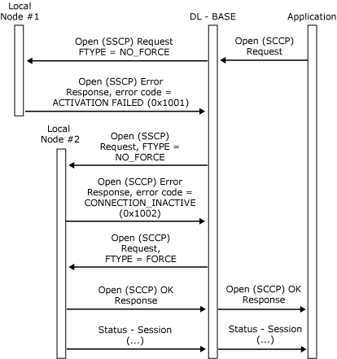

# Resource Location for Open SSCP
When attempting to find a free logical unit (LU) across more than one local node, the application does not need to know which local node owns the LU. The DL-BASE is responsible for finding a suitable local node, using the mechanism described. The description is intended to assist in interpreting traces of the message flows involved, and is not needed to write an application  
  
 The open force type field in the [Open(SSCP) Request](./open-sscp-request2.md) specifies either a forced or nonforced Open. If the LU for which the Open is intended does not have an active system services control point (SSCP) session because its link is inactive, a forced Open instructs the local node to attempt to activate the link and the SSCP session. A nonforced Open succeeds only if the SSCP session is already active, and otherwise returns with an error code indicating the state of the LU's connection.  
  
 When the application issues the **Open(SSCP) Request**, it does not set the open force type field. The DL-BASE issues a nonforced Open to each node in turn until it finds an LU that already has an active SSCP session. If none of these Opens succeeds, the DL-BASE issues a forced Open to the node that returned the best error code—that is, the one most likely to be able to activate the session.  
  
 The sample message flows in the following figure show this process for two local nodes. The DL-BASE tries each in turn, using nonforced Opens. The error code from node #2 indicates that it is more likely to be able to activate the SSCP session than node #1, so the DL-BASE sends a forced Open to node #2. The application is aware only of the first request and its response.  
  
   
Sample message flow for two local nodes  
  
 To enable applications to restart after a disastrous failure (such as terminating the 3270 emulation program), the local node also accepts an [Open(SSCP) Request](./open-sscp-request2.md) from an application that has failed and has been restarted, providing the same source locality, partner, index (LPI) fields are used. In this case, a **TERM-SELF** message is sent to the host if the LU is bound.  
  
 The SNA server LU through which the application communicates is selected by the relationship between the APPL record and the LU or LU group record in the configuration file. The application specifies its name using the source name field on the **Open(SSCP) Request**. The local node fills in the LU or LU group number, selects an unused LU within the LU group (if the association is to an LU group), and informs the application of this LU number on the [Open(SSCP) Response](./open-sscp-response1.md).  
  
 The **Open(SSCP) Request** specifies the following:  
  
- The source application name.  
  
- A resource identifier that can be used by the application to correlate the [Open(PLU) Request](./open-plu-request2.md) that is sent to the application. (For more information, see [Opening the PLU Connection](../core/opening-the-plu-connection1.md).)  
  
- A connection information control block, which specifies the response header usage, checks that the local node should perform for the LU. If the field for a code is set to 0x01, that receive check will be carried out by the data flow control layer of the local node on data arriving from the host. The corresponding send checks are unaffected and are always performed. The connection information control block is provided because these receive checks are optional in SNA. However, it is anticipated that most applications will require all these checks to be performed (all values set to 0x01).  
  
- An indicator that specifies whether the application is to be treated as high or low priority. All SNA server 3270 LUs are marked as high priority (printers do not send significant data inbound). The effect of high priority is to enable data to be progressed faster to the host when the link is busy.  
  
- An indicator that specifies whether the application is an LUA. This determines whether the local node and the application will communicate using the LUA variant of the function management interface (FMI). (For more information, see [FMI Concepts](../core/fmi-concepts1.md).)  
  
- An indicator that specifies a nonforced or forced Open. This determines whether the local node will attempt to activate the SSCP session if it is not currently active.  
  
  The [Open(SSCP) Request](./open-sscp-request2.md) can fail for one of several reasons, which can be determined from the error codes on the [Open(SSCP) Response](./open-sscp-response1.md) sent to the application, as detailed in the following list:  
  
- The local node may still be initializing (retrieving information from the configuration file). In this case, the application can retry immediately.  
  
- The configuration file may not have an entry for the application, or the application record in the configuration file may not point to an LU or LU group record.  
  
- For a nonforced Open, the SSCP session may be inactive.  
  
